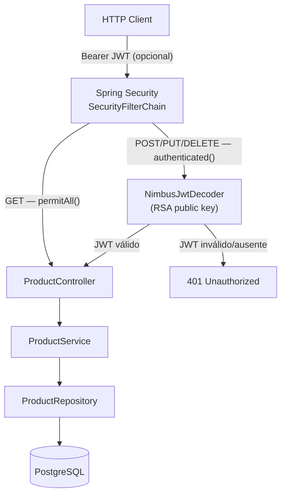
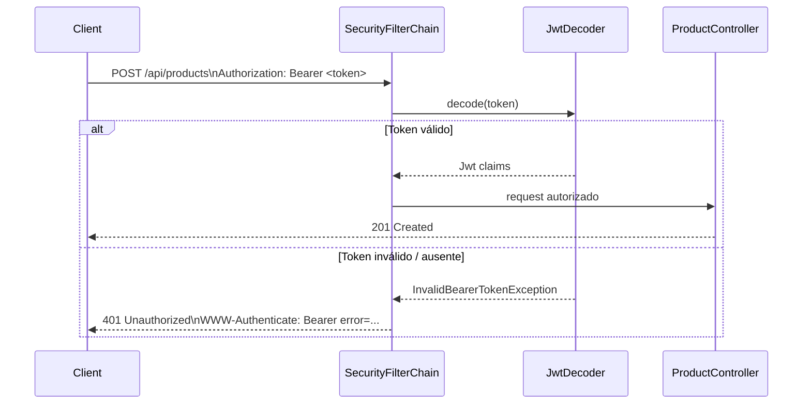

# Design Document: API Security (JWT / RSA Resource Server)

## Overview

Este feature agrega seguridad basada en JWT al servicio `products`. Spring Security actúa como **OAuth2 Resource Server**: valida los tokens JWT entrantes usando una clave pública RSA local, sin depender de ningún proveedor OAuth externo.

Reglas de acceso:
- `GET /api/products` y `GET /api/products/{id}` → **públicos** (sin token).
- `POST`, `PUT`, `DELETE /api/products/**` → **protegidos** (requieren `Authorization: Bearer <jwt>` válido).

El par de llaves RSA se genera con `openssl`. La clave privada firma los tokens externamente; la clave pública (`public.pem`) se incluye en el classpath para que el servicio valide firmas. La clave privada se excluye del control de versiones vía `.gitignore`.

CORS se configura de forma externalizada en `application.yaml`. CSRF se desactiva y las sesiones son `STATELESS`.

---

## Generación del par de llaves RSA

```bash
# 1. Generar clave privada PKCS#8 de 2048 bits
openssl genpkey -algorithm RSA -pkeyopt rsa_keygen_bits:2048 \
  -out products/src/main/resources/certs/private.pem

# 2. Extraer la clave pública X.509
openssl rsa -pubout \
  -in  products/src/main/resources/certs/private.pem \
  -out products/src/main/resources/certs/public.pem
```

> `private.pem` debe estar en `.gitignore`. Solo `public.pem` se versiona.

---

## Architecture





---

## Components and Interfaces

### SecurityConfig

**Ubicación**: `com.example.products.config.SecurityConfig`

**Responsabilidades**:
- Definir el bean `SecurityFilterChain` con las reglas de autorización HTTP.
- Registrar el bean `JwtDecoder` que carga `public.pem` desde el classpath.
- Registrar el bean `CorsConfigurationSource` que lee los orígenes permitidos desde `CorsProperties`.

```java
@Configuration
@EnableWebSecurity
public class SecurityConfig {

    @Bean
    public SecurityFilterChain securityFilterChain(
            HttpSecurity http,
            CorsConfigurationSource corsSource) throws Exception {

        http
            .cors(cors -> cors.configurationSource(corsSource))
            .csrf(AbstractHttpConfigurer::disable)
            .sessionManagement(sm ->
                sm.sessionCreationPolicy(SessionCreationPolicy.STATELESS))
            .authorizeHttpRequests(auth -> auth
                .requestMatchers(HttpMethod.GET, "/api/products", "/api/products/**").permitAll()
                .anyRequest().authenticated()
            )
            .oauth2ResourceServer(oauth2 ->
                oauth2.jwt(Customizer.withDefaults()));

        return http.build();
    }

    @Bean
    public JwtDecoder jwtDecoder(
            @Value("${spring.security.oauth2.resourceserver.jwt.public-key-location}")
            RSAPublicKey publicKey) {
        return NimbusJwtDecoder.withPublicKey(publicKey).build();
    }

    @Bean
    public CorsConfigurationSource corsConfigurationSource(CorsProperties props) {
        CorsConfiguration config = new CorsConfiguration();
        config.setAllowedOrigins(props.getAllowedOrigins());
        config.setAllowedMethods(List.of("GET","POST","PUT","DELETE","OPTIONS"));
        config.setAllowedHeaders(List.of("Authorization","Content-Type"));
        config.setExposedHeaders(List.of("Authorization"));

        UrlBasedCorsConfigurationSource source = new UrlBasedCorsConfigurationSource();
        source.registerCorsConfiguration("/api/**", config);
        return source;
    }
}
```

### CorsProperties

**Ubicación**: `com.example.products.config.CorsProperties`

**Responsabilidades**: Mapear `security.cors.*` de `application.yaml` a un bean tipado.

```java
@ConfigurationProperties(prefix = "security.cors")
public class CorsProperties {
    private List<String> allowedOrigins = List.of("*");
    // getter / setter
}
```

---

## Data Models

### Configuración application.yaml (secciones nuevas)

```yaml
spring:
  security:
    oauth2:
      resourceserver:
        jwt:
          public-key-location: classpath:certs/public.pem

security:
  cors:
    allowed-origins:
      - "http://localhost:3000"
      - "https://mi-frontend.example.com"
```

### Dependencia Maven (pom.xml)

```xml
<dependency>
    <groupId>org.springframework.boot</groupId>
    <artifactId>spring-boot-starter-oauth2-resource-server</artifactId>
</dependency>
```

### Estructura de archivos nuevos

```
products/
└── src/
    └── main/
        ├── java/com/example/products/config/
        │   ├── SecurityConfig.java       # SecurityFilterChain + JwtDecoder + CORS bean
        │   └── CorsProperties.java       # @ConfigurationProperties("security.cors")
        └── resources/
            └── certs/
                ├── public.pem            # Clave pública RSA (versionada)
                └── private.pem           # Clave privada RSA (.gitignore)
```

### Entradas .gitignore

```
# RSA private key — never commit
**/certs/private.pem
```

---

## Correctness Properties

*A property is a characteristic or behavior that should hold true across all valid executions of a system — essentially, a formal statement about what the system should do. Properties serve as the bridge between human-readable specifications and machine-verifiable correctness guarantees.*

### Property 1: GET endpoints son siempre públicos

*Para cualquier* estado del catálogo de productos y cualquier valor del header `Authorization` (ausente, vacío, inválido o expirado), una petición `GET /api/products` o `GET /api/products/{id}` debe retornar `200 OK` (o `404` si el id no existe), nunca `401` ni `403`.

**Validates: Requirements 1.1, 1.2, 1.3**

### Property 2: JWT válido permite operaciones de escritura

*Para cualquier* método de escritura (`POST`, `PUT`, `DELETE`) sobre `/api/products/**` acompañado de un JWT firmado con la clave privada RSA correcta y con `exp` en el futuro, el `SecurityFilterChain` debe dejar pasar la petición al controlador (respuesta distinta de `401`/`403`).

**Validates: Requirements 2.1, 2.2, 2.3**

### Property 3: Ausencia de token en escritura retorna 401 con WWW-Authenticate

*Para cualquier* petición `POST`, `PUT` o `DELETE` a `/api/products/**` sin header `Authorization`, la respuesta debe ser `401 Unauthorized` y debe incluir el header `WWW-Authenticate: Bearer`.

**Validates: Requirements 2.4, 2.5, 2.6, 8.1**

### Property 4: JWT inválido en escritura retorna 401

*Para cualquier* petición de escritura (`POST`, `PUT`, `DELETE`) a `/api/products/**` que incluya un JWT con firma incorrecta, estructura malformada o claim `exp` expirado, la respuesta debe ser `401 Unauthorized` con header `WWW-Authenticate: Bearer` que contenga una descripción del error.

**Validates: Requirements 3.1, 3.2, 3.3, 3.4, 8.2**

### Property 5: Preflight OPTIONS retorna 200 sin autenticación

*Para cualquier* petición `OPTIONS` a `/api/**`, el `SecurityFilterChain` debe retornar `200 OK` sin requerir token de autenticación.

**Validates: Requirements 5.4**

---

## Error Handling

| Situación | Respuesta HTTP | Header adicional |
|---|---|---|
| Write endpoint sin token | `401 Unauthorized` | `WWW-Authenticate: Bearer` |
| Write endpoint con JWT expirado | `401 Unauthorized` | `WWW-Authenticate: Bearer error="invalid_token", error_description="..."` |
| Write endpoint con JWT firma inválida | `401 Unauthorized` | `WWW-Authenticate: Bearer error="invalid_token"` |
| Write endpoint con JWT malformado | `401 Unauthorized` | `WWW-Authenticate: Bearer error="invalid_token"` |
| JWT válido pero sin autorización para el recurso | `403 Forbidden` | — |
| `public.pem` ausente al arrancar | Fallo de startup | Log: `IllegalStateException` / `BeanCreationException` |

Spring Security's `BearerTokenAuthenticationEntryPoint` maneja automáticamente los `401` con el header `WWW-Authenticate`. No se requiere un `GlobalExceptionHandler` adicional para estos casos.

---

## Testing Strategy

### Enfoque dual: unit tests + property-based tests

**Unit / integration tests** (MockMvc + `@WebMvcTest` o `@SpringBootTest`):
- Verificar que el contexto Spring arranca correctamente con `public.pem` presente.
- Verificar que el contexto falla si `public.pem` está ausente.
- Verificar que CORS devuelve los headers correctos (`Access-Control-Allow-Methods`, `Access-Control-Allow-Headers`, `Access-Control-Expose-Headers`).
- Verificar que no se crea sesión HTTP (`Set-Cookie` ausente).
- Verificar que CSRF está desactivado (POST sin CSRF token + JWT válido → no 403).
- Verificar que los orígenes CORS se leen de `security.cors.allowed-origins`.

**Property-based tests** (jqwik — librería PBT para Java/JUnit 5):

> Cada property test debe ejecutarse con mínimo **100 iteraciones**.
> Cada test debe incluir un comentario con el tag:
> `// Feature: api-security, Property <N>: <texto de la propiedad>`

| Property | Descripción del test | Librería |
|---|---|---|
| P1 | Generar tokens aleatorios (válidos, inválidos, ausentes) y verificar que GET siempre retorna 200/404 | jqwik |
| P2 | Generar JWTs válidos con claims aleatorios y verificar que POST/PUT/DELETE son permitidos | jqwik |
| P3 | Generar peticiones de escritura sin token y verificar 401 + `WWW-Authenticate: Bearer` | jqwik |
| P4 | Generar JWTs con firma incorrecta / expirados / malformados y verificar 401 en escritura | jqwik |
| P5 | Generar peticiones OPTIONS a paths aleatorios bajo `/api/**` y verificar 200 sin token | jqwik |

**Dependencia de test para jqwik**:
```xml
<dependency>
    <groupId>net.jqwik</groupId>
    <artifactId>jqwik</artifactId>
    <version>1.9.3</version>
    <scope>test</scope>
</dependency>
```

**Ejemplo de estructura de property test**:
```java
// Feature: api-security, Property 1: GET endpoints son siempre públicos
@Property(tries = 100)
void getEndpointsAreAlwaysPublic(@ForAll("invalidTokens") String token) throws Exception {
    mockMvc.perform(get("/api/products")
            .header("Authorization", token))
           .andExpect(status().isOk());
}
```

Los tests de integración de seguridad deben extender `AbstractIntegrationTest` para disponer de la base de datos real vía Testcontainers, o usar `@WebMvcTest` con un `JwtDecoder` mockeado para tests de capa de seguridad pura.
