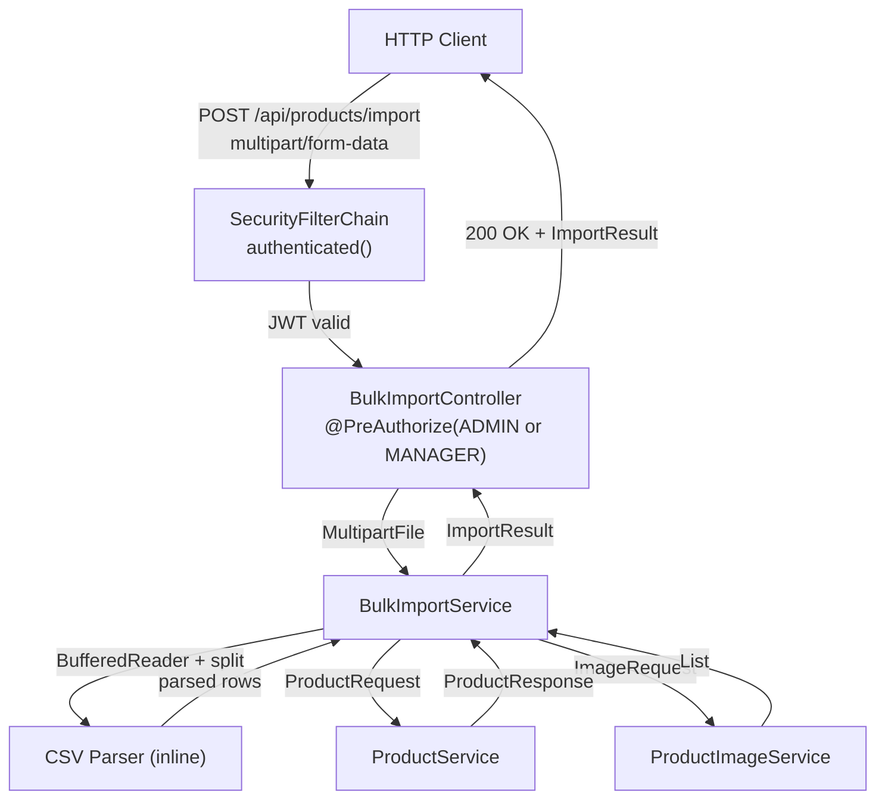

# Design Document: Bulk Product Import

## Overview

This feature adds a `POST /api/products/import` endpoint that accepts a `multipart/form-data` CSV file upload and creates products with associated images in bulk. Each CSV row maps to one product + one image; rows are processed independently so a failure on one row does not abort the rest.

The design follows the existing layered architecture: a new `BulkImportController` delegates to a new `BulkImportService`, which orchestrates CSV parsing and delegates to the existing `ProductService` and `ProductImageService`. No new JPA entities or schema migrations are required — this feature is purely a new orchestration layer on top of existing persistence.

CSV parsing is done inline with `BufferedReader` + `String.split(",", -1)` — no external CSV library is introduced, keeping the dependency footprint minimal.

---

## Architecture



---

## Sequence Diagram

```mermaid
sequenceDiagram
    participant C as Client
    participant SC as SecurityFilterChain
    participant BIC as BulkImportController
    participant BIS as BulkImportService
    participant PS as ProductService
    participant PIS as ProductImageService

    C->>SC: POST /api/products/import\nAuthorization: Bearer <token>\nContent-Type: multipart/form-data
    SC->>SC: validate JWT signature + expiry
    alt no token or invalid JWT
        SC-->>C: 401 Unauthorized
    else JWT valid
        SC->>BIC: forward request
        BIC->>BIC: @PreAuthorize — check ADMIN or MANAGER role
        alt insufficient role
            BIC-->>C: 403 Forbidden
        else authorized
        BIC->>BIC: validate file present, content type, non-empty
        alt invalid file
            BIC-->>C: 400 Bad Request
        else valid file
            BIC->>BIS: importProducts(file)
            loop for each non-blank CSV row
                BIS->>BIS: parse & validate row
                alt row invalid (wrong columns / blank name / bad price / bad URL)
                    BIS->>BIS: record ImportRowResult FAILED
                else row valid
                    BIS->>PS: create(ProductRequest)
                    alt ProductService throws
                        BIS->>BIS: record ImportRowResult FAILED
                    else product created
                        BIS->>PIS: addImages(productId, ImageRequest)
                        alt ProductImageService throws
                            BIS->>BIS: record ImportRowResult FAILED
                        else image added
                            BIS->>BIS: record ImportRowResult SUCCESS
                        end
                    end
                end
            end
            BIS-->>BIC: ImportResult
            BIC-->>C: 200 OK + ImportResult
        end
    end
```

---

## Components and Interfaces

### BulkImportController

**Location**: `com.example.products.controller.BulkImportController`

**Responsibilities**:
- Accept `multipart/form-data` at `POST /api/products/import`.
- Enforce role authorization via `@PreAuthorize("hasAnyRole('ADMIN', 'MANAGER')")` — returns `403 Forbidden` if the authenticated user lacks the required role.
- Validate that the `file` part is present, has an acceptable content type (`text/csv` or `application/octet-stream`), and is non-empty.
- Return `400 Bad Request` with a descriptive message for any file-level validation failure.
- Delegate all import logic to `BulkImportService`.
- Return `200 OK` with the `ImportResult` body on completion.

```java
@RestController
@RequestMapping("/api/products")
public class BulkImportController {

    // POST /api/products/import
    // Consumes: multipart/form-data
    // Produces: application/json
    // Returns: 200 OK + ImportResult
    //          400 Bad Request (missing/invalid/empty file)
    //          401 Unauthorized (no JWT)
    //          403 Forbidden (insufficient role — enforced by @PreAuthorize)
    @PreAuthorize("hasAnyRole('ADMIN', 'MANAGER')")
    ResponseEntity<ImportResult> importProducts(
        @RequestParam("file") MultipartFile file);
}
```

### BulkImportService / BulkImportServiceImpl

**Location**: `com.example.products.service.BulkImportService` and `BulkImportServiceImpl`

**Responsibilities**:
- Read the `MultipartFile` input stream via `BufferedReader`.
- Parse each non-blank line using `String.split(",", -1)` (limit `-1` preserves trailing empty fields for blank descriptions).
- Validate each row: column count == 4, name non-blank, price parseable and >= 0.01, URL matches `https?://.*`.
- For valid rows: call `ProductService.create()` then `ProductImageService.addImages()`.
- Catch any exception per row, record it as `FAILED`, and continue.
- Build and return the `ImportResult` with per-row results and summary counts.

```java
public interface BulkImportService {
    ImportResult importProducts(MultipartFile file) throws IOException;
}
```

### SecurityConfig (no changes required)

The existing `SecurityConfig` already covers this endpoint with its general rule:

```java
.requestMatchers(HttpMethod.GET, "/api/products/**").permitAll()
.requestMatchers("/api/products/**").authenticated()
```

`POST /api/products/import` matches the second rule — JWT authentication is required. Role enforcement is handled at the controller level via `@PreAuthorize`, consistent with the approach used across all other write endpoints (`ProductController`, `ProductImageController`).

---

## Data Models

### ImportResult (response DTO)

```java
@Data
@Builder
@NoArgsConstructor
@AllArgsConstructor
public class ImportResult {
    private int totalRows;
    private int successCount;
    private int failedCount;
    private List<ImportRowResult> rows;
}
```

### ImportRowResult (response DTO)

```java
@Data
@Builder
@NoArgsConstructor
@AllArgsConstructor
public class ImportRowResult {
    private int rowNumber;          // 1-based
    private RowStatus status;       // SUCCESS or FAILED
    private Long productId;         // null on failure
    private String errorMessage;    // null on success
}
```

### RowStatus (enum)

```java
public enum RowStatus {
    SUCCESS,
    FAILED
}
```

### CSV Row Structure

| Column index | Field       | Validation                                      |
|-------------|-------------|--------------------------------------------------|
| 0           | Name        | Non-blank                                        |
| 1           | Description | Any value including blank (treated as empty)     |
| 2           | Price       | Parseable as `BigDecimal`, >= 0.01               |
| 3           | URL         | Matches `https?://.*`                            |

No header row — first line is data, consistent with the existing `import.csv` format.

---

## Correctness Properties

*A property is a characteristic or behavior that should hold true across all valid executions of a system — essentially, a formal statement about what the system should do. Properties serve as the bridge between human-readable specifications and machine-verifiable correctness guarantees.*

### Property 1: Unauthenticated requests are rejected

*For any* request to `POST /api/products/import` that does not include an `Authorization: Bearer` header, the response status must be `401 Unauthorized`.

**Validates: Requirements 1.1**

### Property 2: Insufficient role is rejected

*For any* valid JWT that does not contain the `ADMIN` or `MANAGER` role, a request to `POST /api/products/import` must return `403 Forbidden`.

**Validates: Requirements 1.2**

### Property 3: Authorized roles allow processing

*For any* valid JWT containing either the `ADMIN` or `MANAGER` role, a request to `POST /api/products/import` with a valid CSV must not be rejected with `401` or `403`.

**Validates: Requirements 1.3, 1.4**

### Property 4: Invalid content type is rejected

*For any* multipart upload to `POST /api/products/import` where the file part has a content type other than `text/csv` or `application/octet-stream`, the response must be `400 Bad Request`.

**Validates: Requirements 2.3**

### Property 5: Invalid rows are marked FAILED and processing continues

*For any* CSV file containing a mix of valid rows and invalid rows (wrong column count, blank name, invalid price, or invalid URL), every invalid row must appear in the result with `FAILED` status and a non-blank error message, and every valid row must be processed normally.

**Validates: Requirements 3.3, 3.4, 3.5, 3.6**

### Property 6: Blank description is treated as valid

*For any* CSV row where the description field is blank or empty, the row must be processed successfully (not marked as FAILED due to the description), and the created product must have an empty or null description.

**Validates: Requirements 3.7**

### Property 7: Row-level failure isolation

*For any* CSV file where one or more rows cause `ProductService` or `ProductImageService` to throw an exception, the failing rows must be recorded as `FAILED` and all other valid rows must still be processed and recorded as `SUCCESS`.

**Validates: Requirements 4.4, 4.5**

### Property 8: Import always returns 200 with ImportResult

*For any* valid CSV upload (regardless of per-row success or failure), the HTTP response status must be `200 OK` and the body must be a valid `ImportResult`.

**Validates: Requirements 5.1**

### Property 9: Result count invariant

*For any* CSV file with N non-blank rows, the `ImportResult` must contain exactly N `ImportRowResult` entries, and `totalRows == successCount + failedCount == N`.

**Validates: Requirements 5.2, 5.5**

### Property 10: ImportRowResult structure completeness

*For any* `ImportRowResult` with `SUCCESS` status, the `productId` must be non-null and `errorMessage` must be null. *For any* `ImportRowResult` with `FAILED` status, the `errorMessage` must be non-blank and `productId` must be null.

**Validates: Requirements 5.3, 5.4**

### Property 11: CSV round-trip data fidelity

*For any* set of valid product records (name, description, price, URL), writing them to a CSV and uploading it must produce an `ImportResult` where all rows are `SUCCESS` and querying each created product returns exactly the name, description, price, and image URL from the original record — without modification.

**Validates: Requirements 6.1, 6.2**

---

## Error Handling

| Situation | Handler | HTTP Status | Response |
|---|---|---|---|
| No `Authorization` header | Spring Security | `401 Unauthorized` | `WWW-Authenticate: Bearer` |
| JWT present but role insufficient | `@PreAuthorize` on `BulkImportController` | `403 Forbidden` | empty body |
| `file` part missing | `BulkImportController` | `400 Bad Request` | `ErrorResponse` with message |
| Invalid content type | `BulkImportController` | `400 Bad Request` | `ErrorResponse` with message |
| Empty file (0 bytes or only blank lines) | `BulkImportController` | `400 Bad Request` | `ErrorResponse` with message |
| Row parse/validation failure | `BulkImportServiceImpl` (per-row catch) | — | `ImportRowResult` with `FAILED` + error message |
| `ProductService.create` throws | `BulkImportServiceImpl` (per-row catch) | — | `ImportRowResult` with `FAILED` + exception message |
| `ProductImageService.addImages` throws | `BulkImportServiceImpl` (per-row catch) | — | `ImportRowResult` with `FAILED` + exception message |
| Unrecoverable `IOException` reading file | `GlobalExceptionHandler` | `500 Internal Server Error` | `ErrorResponse` |

Row-level errors are never surfaced as HTTP error codes — they are always captured in the `ImportResult`. Only file-level errors (missing, wrong type, empty) produce a `400` before processing begins.

---

## Testing Strategy

### Dual approach: unit tests + property-based tests

**Unit tests** (JUnit 5 + Mockito — `@ExtendWith(MockitoExtension.class)`):

`BulkImportServiceImplTest`:
- Happy path: single valid row → `ProductService.create` and `ProductImageService.addImages` called with correct args, result has 1 SUCCESS.
- Blank description row → treated as valid, description passed as empty string.
- Row with wrong column count → FAILED, processing continues.
- Row with blank name → FAILED, processing continues.
- Row with invalid price (non-numeric, zero, negative) → FAILED, processing continues.
- Row with invalid URL → FAILED, processing continues.
- `ProductService.create` throws → row FAILED, next row still processed.
- `ProductImageService.addImages` throws → row FAILED, next row still processed.
- Summary counts: `totalRows == successCount + failedCount`.
- Row numbers are 1-based and match the CSV line position.

`BulkImportControllerTest` (`@WebMvcTest`):
- No JWT → `401`.
- JWT without ADMIN/MANAGER role → `403`.
- Missing `file` part → `400`.
- Wrong content type → `400`.
- Empty file → `400`.
- Valid file with ADMIN JWT → `200` with `ImportResult`.

**Property-based tests** (jqwik):

> Each property test must run with minimum **100 iterations**.
> Each test must include a comment: `// Feature: bulk-product-import, Property <N>: <property text>`

| Property | Test description |
|---|---|
| P1 | Generate requests without auth headers; verify all return 401 |
| P2 | Generate JWTs with random roles excluding ADMIN/MANAGER; verify 403 |
| P3 | Generate JWTs with ADMIN or MANAGER role; verify not 401/403 |
| P4 | Generate random content type strings (excluding valid ones); verify 400 |
| P5 | Generate CSVs mixing valid and invalid rows; verify invalid rows are FAILED, valid rows are processed |
| P6 | Generate rows with blank/empty description; verify SUCCESS and empty description on created product |
| P7 | Generate CSVs where mocked services throw on specific rows; verify those rows FAILED, others SUCCESS |
| P8 | Generate any valid CSV; verify response is always 200 with non-null ImportResult |
| P9 | Generate CSVs with N non-blank rows; verify result has N entries and totalRows == successCount + failedCount |
| P10 | Generate mixed success/failure CSVs; verify SUCCESS results have non-null productId and null errorMessage; FAILED results have non-blank errorMessage and null productId |
| P11 | Generate random valid product records, write to CSV, import, query created products; verify all field values match exactly |

Property tests for P7–P11 that require database access extend `AbstractIntegrationTest`. Tests for P1–P4 use `@WebMvcTest` with a mocked `JwtDecoder`.

**jqwik dependency** (already present from product-images feature):
```xml
<dependency>
    <groupId>net.jqwik</groupId>
    <artifactId>jqwik</artifactId>
    <version>1.9.3</version>
    <scope>test</scope>
</dependency>
```

**Example property test structure**:
```java
// Feature: bulk-product-import, Property 11: CSV round-trip data fidelity
@Property(tries = 100)
void csvRoundTripPreservesAllFields(
        @ForAll("validProductRecords") List<ProductRecord> records) throws Exception {
    // 1. Build CSV string from records
    // 2. POST to /api/products/import with ADMIN JWT
    // 3. Assert all rows SUCCESS
    // 4. For each SUCCESS row, GET /api/products/{productId}
    // 5. Assert name, description, price match; GET images and assert URL matches
}
```
