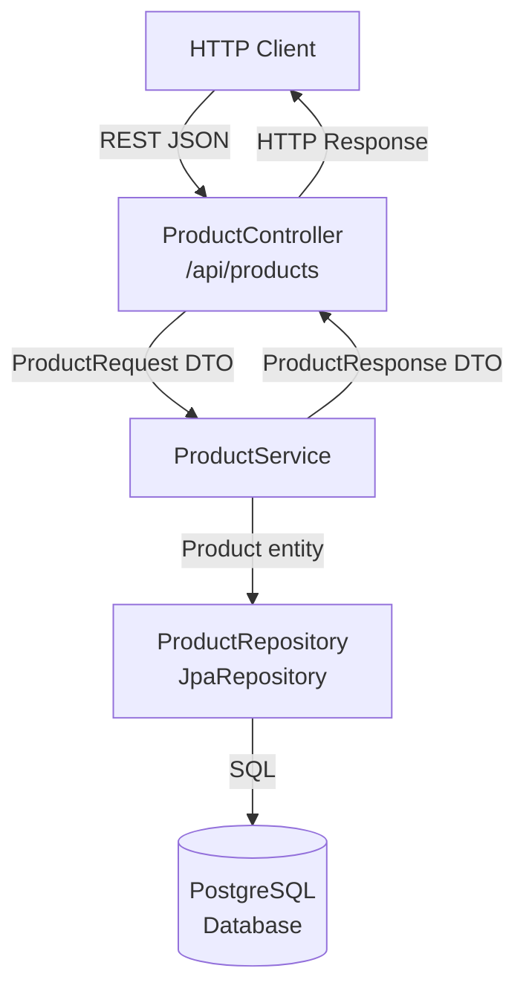
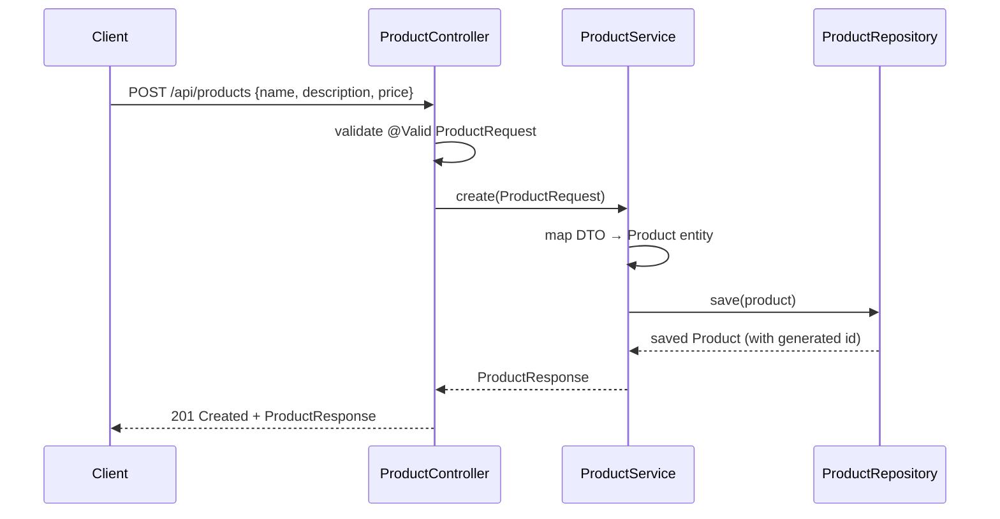
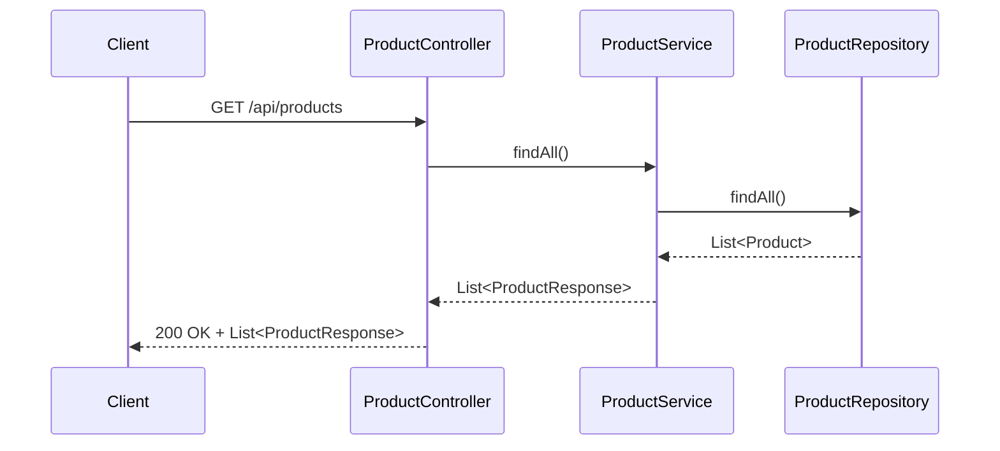
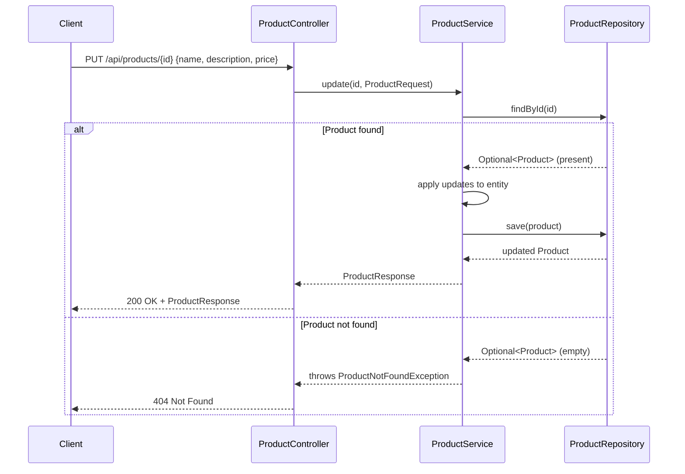
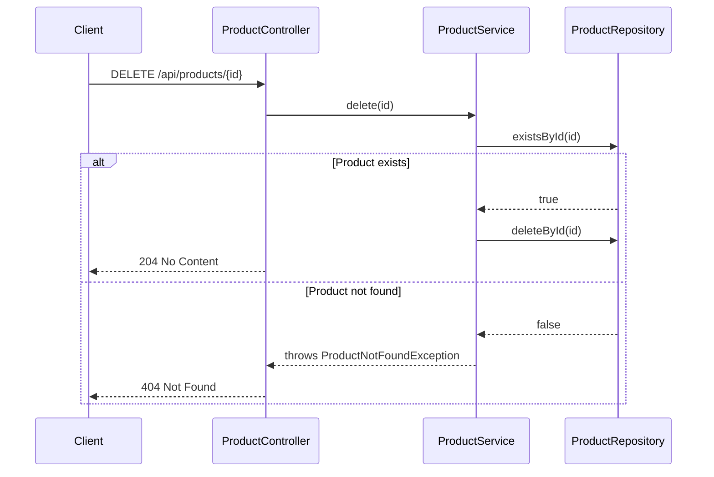

# Design Document: Product CRUD

## Overview

This feature implements full CRUD (Create, Read, Update, Delete) operations for a `Product` entity in the `products` Spring Boot application. It follows a standard layered architecture: REST controller → service → repository → JPA entity, exposing a RESTful API under `/api/products`.

The implementation uses Spring Data JPA for persistence, Liquibase for database schema management, Lombok for boilerplate reduction, and follows Spring Boot 4.x conventions with a PostgreSQL database.

## Architecture



## Sequence Diagrams

### Create Product (POST /api/products)



### Get All Products (GET /api/products)



### Update Product (PUT /api/products/{id})



### Delete Product (DELETE /api/products/{id})



## Components and Interfaces

### ProductController

**Purpose**: Handles HTTP requests, delegates to service, maps responses.

**Interface**:
```java
@RestController
@RequestMapping("/api/products")
public class ProductController {
    ProductResponse create(@Valid @RequestBody ProductRequest request);           // POST /
    List<ProductResponse> findAll();                                              // GET /
    ProductResponse findById(@PathVariable Long id);                             // GET /{id}
    ProductResponse update(@PathVariable Long id,
                           @Valid @RequestBody ProductRequest request);           // PUT /{id}
    void delete(@PathVariable Long id);                                          // DELETE /{id}
}
```

**Responsibilities**:
- Map HTTP verbs to service calls
- Validate incoming request bodies via `@Valid`
- Return appropriate HTTP status codes (201, 200, 204, 404)
- Delegate all business logic to `ProductService`

### ProductService

**Purpose**: Encapsulates business logic and DTO ↔ entity mapping.

**Interface**:
```java
public interface ProductService {
    ProductResponse create(ProductRequest request);
    List<ProductResponse> findAll();
    ProductResponse findById(Long id);
    ProductResponse update(Long id, ProductRequest request);
    void delete(Long id);
}
```

**Responsibilities**:
- Map `ProductRequest` DTO to `Product` entity and vice versa
- Enforce business rules (e.g., price must be positive)
- Throw `ProductNotFoundException` when entity is not found
- Coordinate with `ProductRepository`

### ProductRepository

**Purpose**: Data access layer via Spring Data JPA.

**Interface**:
```java
public interface ProductRepository extends JpaRepository<Product, Long> {
    // Inherits: save, findById, findAll, existsById, deleteById, count
    List<Product> findByNameContainingIgnoreCase(String name); // optional search
}
```

**Responsibilities**:
- Provide CRUD persistence operations
- Delegate query generation to Spring Data JPA

### GlobalExceptionHandler

**Purpose**: Centralised error handling via `@RestControllerAdvice`.

**Interface**:
```java
@RestControllerAdvice
public class GlobalExceptionHandler {
    ErrorResponse handleProductNotFound(ProductNotFoundException ex);
    ErrorResponse handleValidation(MethodArgumentNotValidException ex);
}
```

## Data Models

### Product (JPA Entity)

```java
@Entity
@Table(name = "products")
@Data
@Builder
@NoArgsConstructor
@AllArgsConstructor
public class Product {
    @Id
    @GeneratedValue(strategy = GenerationType.IDENTITY)
    private Long id;

    @Column(nullable = false)
    private String name;

    private String description;

    @Column(nullable = false)
    private BigDecimal price;
}
```

**Validation Rules**:
- `name`: non-null, non-blank
- `price`: non-null, must be > 0

### ProductRequest (DTO — inbound)

```java
@Data
@Builder
@NoArgsConstructor
@AllArgsConstructor
public class ProductRequest {
    @NotBlank
    private String name;

    private String description;

    @NotNull
    @DecimalMin("0.01")
    private BigDecimal price;
}
```

### ProductResponse (DTO — outbound)

```java
@Data
@Builder
@NoArgsConstructor
@AllArgsConstructor
public class ProductResponse {
    private Long id;
    private String name;
    private String description;
    private BigDecimal price;
}
```

### ErrorResponse

```java
@Data
@Builder
@AllArgsConstructor
public class ErrorResponse {
    private int status;
    private String message;
    private Instant timestamp;
}
```

## Key Functions with Formal Specifications

### ProductServiceImpl.create()

```java
public ProductResponse create(ProductRequest request)
```

**Preconditions:**
- `request` is non-null
- `request.name` is non-blank
- `request.price` > 0

**Postconditions:**
- A new `Product` row is persisted with a generated `id`
- Returns `ProductResponse` with all fields populated including the new `id`
- No existing products are modified

**Loop Invariants:** N/A

### ProductServiceImpl.update()

```java
public ProductResponse update(Long id, ProductRequest request)
```

**Preconditions:**
- `id` is non-null and positive
- `request` is non-null and valid (same rules as `create`)
- A `Product` with the given `id` exists in the repository

**Postconditions:**
- The persisted `Product` with `id` has all fields replaced by `request` values
- Returns `ProductResponse` reflecting the updated state
- No other products are modified
- Throws `ProductNotFoundException` if no product with `id` exists

**Loop Invariants:** N/A

### ProductServiceImpl.delete()

```java
public void delete(Long id)
```

**Preconditions:**
- `id` is non-null and positive
- A `Product` with the given `id` exists in the repository

**Postconditions:**
- No `Product` with `id` exists in the repository after the call
- All other products remain unchanged
- Throws `ProductNotFoundException` if no product with `id` exists

**Loop Invariants:** N/A

## Algorithmic Pseudocode

### Create Algorithm

```pascal
ALGORITHM create(request: ProductRequest): ProductResponse
PRECONDITION: request != null AND request.name != blank
              AND request.price > 0

BEGIN
  product ← Product.builder()
               .name(request.name)
               .description(request.description)
               .price(request.price)
               .build()

  saved ← repository.save(product)

  RETURN toResponse(saved)
END

POSTCONDITION: result.id != null AND result reflects saved state
```

### Update Algorithm

```pascal
ALGORITHM update(id: Long, request: ProductRequest): ProductResponse
PRECONDITION: id != null AND request is valid

BEGIN
  existing ← repository.findById(id)

  IF existing IS EMPTY THEN
    THROW ProductNotFoundException("Product not found: " + id)
  END IF

  product ← existing.get()
  product.setName(request.name)
  product.setDescription(request.description)
  product.setPrice(request.price)

  saved ← repository.save(product)

  RETURN toResponse(saved)
END

POSTCONDITION: result reflects updated state OR ProductNotFoundException thrown
```

### Delete Algorithm

```pascal
ALGORITHM delete(id: Long): void
PRECONDITION: id != null

BEGIN
  IF NOT repository.existsById(id) THEN
    THROW ProductNotFoundException("Product not found: " + id)
  END IF

  repository.deleteById(id)
END

POSTCONDITION: no Product with id exists in repository
```

### DTO Mapping Algorithm

```pascal
ALGORITHM toResponse(product: Product): ProductResponse
PRECONDITION: product != null AND product.id != null

BEGIN
  RETURN ProductResponse.builder()
           .id(product.id)
           .name(product.name)
           .description(product.description)
           .price(product.price)
           .build()
END

POSTCONDITION: result contains all fields from product, no nulls for required fields
```

## Example Usage

```java
// POST /api/products
ProductRequest request = ProductRequest.builder()
    .name("Wireless Mouse")
    .description("Ergonomic wireless mouse")
    .price(new BigDecimal("29.99"))
    .build();
// → 201 Created: { "id": 1, "name": "Wireless Mouse", "price": 29.99 }

// GET /api/products/1
// → 200 OK: { "id": 1, "name": "Wireless Mouse", ... }

// PUT /api/products/1
ProductRequest update = ProductRequest.builder()
    .name("Wireless Mouse Pro")
    .price(new BigDecimal("39.99"))
    .build();
// → 200 OK: { "id": 1, "name": "Wireless Mouse Pro", "price": 39.99 }

// DELETE /api/products/1
// → 204 No Content

// GET /api/products/1 (after delete)
// → 404 Not Found: { "status": 404, "message": "Product not found: 1" }
```

## Correctness Properties

*A property is a characteristic or behavior that should hold true across all valid executions of a system — essentially, a formal statement about what the system should do. Properties serve as the bridge between human-readable specifications and machine-verifiable correctness guarantees.*

### Property 1: Create then retrieve round-trip

*For any* valid `ProductRequest`, creating a product via `POST /api/products` and then retrieving it via `GET /api/products/{id}` using the returned `id` should return a `ProductResponse` with field values equal to those in the original request.

**Validates: Requirements 1.1, 1.2, 3.1**

### Property 2: Update then retrieve round-trip

*For any* existing product and any valid `ProductRequest`, updating the product via `PUT /api/products/{id}` and then retrieving it via `GET /api/products/{id}` should return a `ProductResponse` whose fields exactly match the update request values.

**Validates: Requirements 4.1**

### Property 3: Delete then retrieve returns 404

*For any* existing product, deleting it via `DELETE /api/products/{id}` and then calling `GET /api/products/{id}` should return a `404 Not Found` response.

**Validates: Requirements 5.1, 3.2**

### Property 4: Invalid requests are rejected with 400

*For any* `POST` or `PUT` request where `name` is blank or `price` is null or non-positive, the API should return a `400 Bad Request` response and the product catalogue should remain unchanged.

**Validates: Requirements 1.3, 1.4, 4.3, 4.4**

### Property 5: Non-existent id returns 404

*For any* id that does not correspond to an existing product, `GET`, `PUT`, and `DELETE` requests to `/api/products/{id}` should all return a `404 Not Found` response.

**Validates: Requirements 3.2, 4.2, 5.2**

### Property 6: Get all returns complete list

*For any* set of N products in the database, `GET /api/products` should return a JSON array of exactly N `ProductResponse` objects, including the empty array when N = 0.

**Validates: Requirements 2.1, 2.2**

## Error Handling

### ProductNotFoundException

**Condition**: `findById`, `update`, or `delete` called with an id that has no matching row  
**Response**: `404 Not Found` with `ErrorResponse { status: 404, message: "Product not found: {id}" }`  
**Recovery**: Client should verify the id or list all products first

### Validation Error

**Condition**: Request body fails `@Valid` constraints (blank name, null price, negative price)  
**Response**: `400 Bad Request` with field-level error messages from `MethodArgumentNotValidException`  
**Recovery**: Client corrects the request payload and retries

### Unexpected Server Error

**Condition**: Database unavailable or unexpected runtime exception  
**Response**: `500 Internal Server Error` with generic `ErrorResponse`  
**Recovery**: Logged server-side; client should retry with backoff

## Testing Strategy

### Unit Testing Approach

Test `ProductServiceImpl` in isolation using Mockito to mock `ProductRepository`. Cover:
- Happy path for each CRUD operation
- `ProductNotFoundException` thrown when entity not found (update, delete, findById)
- DTO mapping correctness (all fields transferred)

### Property-Based Testing Approach

**Property Test Library**: JUnit 5 with `@ParameterizedTest` / `@MethodSource`

Key properties to verify:
- Any product saved and then retrieved by id returns equal field values
- Updating a product with new values always reflects those values on subsequent read
- Deleting a product always results in 404 on subsequent read regardless of product state

### Integration Testing Approach

Use `@SpringBootTest` + `@AutoConfigureMockMvc` with a test PostgreSQL instance (e.g. Testcontainers):
- Full request/response cycle for each endpoint
- Verify HTTP status codes and response body structure
- Verify persistence side effects (e.g., count changes after create/delete)

## Performance Considerations

- All queries are by primary key (`id`) — O(1) index lookups
- `findAll()` returns unbounded list; pagination via `Pageable` should be added if the product catalogue grows large
- No caching required at this stage; can add `@Cacheable` on `findById` if read-heavy workloads emerge

## Security Considerations

- No authentication/authorisation in scope for this feature; add Spring Security if needed
- Input validation via Bean Validation (`@Valid`) prevents malformed data from reaching the service layer
- `BigDecimal` used for price to avoid floating-point precision issues

## Dependencies

The following dependencies need to be added to `pom.xml`:

| Dependency | Purpose |
|---|---|
| `spring-boot-starter-web` | REST controller support |
| `spring-boot-starter-data-jpa` | JPA / Spring Data repositories |
| `spring-boot-starter-validation` | Bean Validation (`@Valid`, `@NotBlank`, etc.) |
| `org.postgresql:postgresql` (runtime) | PostgreSQL JDBC driver |
| `org.liquibase:liquibase-core` | Database schema management and migrations |
