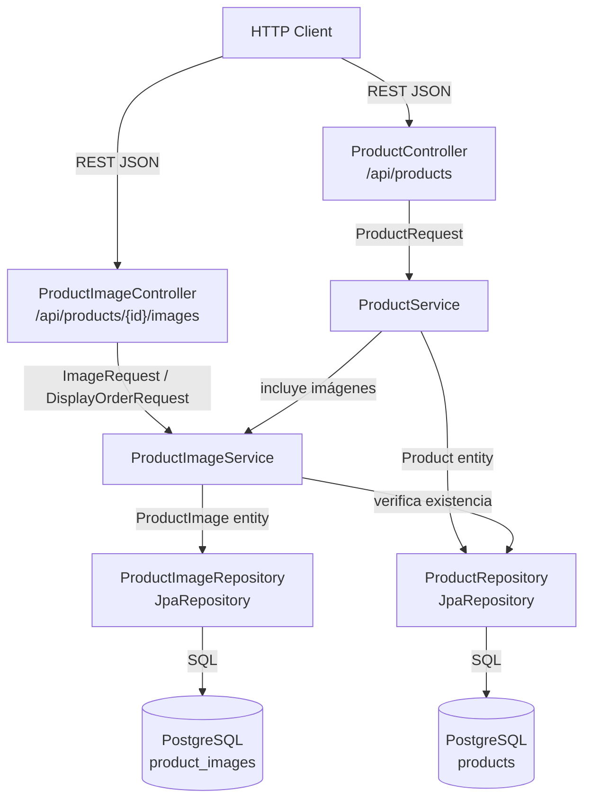
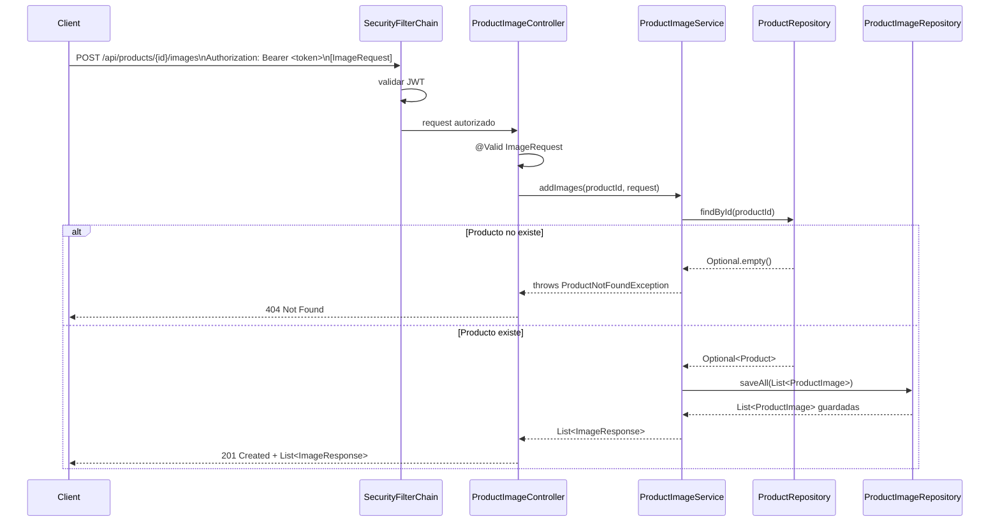
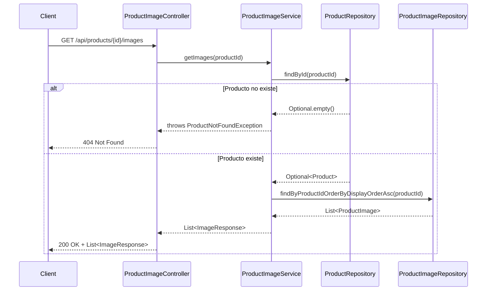
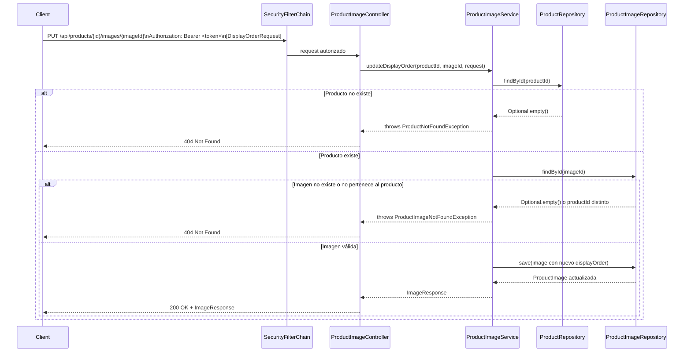
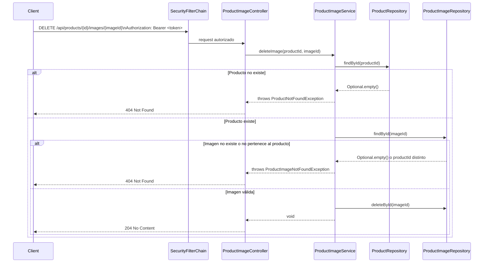

# Design Document: Product Images

## Overview

Este feature extiende el servicio `products` para soportar múltiples imágenes por producto. Las imágenes se representan como URLs (los archivos binarios residen en un proveedor externo como Cloudinary); el servicio persiste únicamente las URLs en una tabla `product_images` relacionada con `products` mediante una clave foránea.

La arquitectura sigue el mismo patrón en capas ya establecido: `ProductImageController` → `ProductImageService` → `ProductImageRepository` → entidad `ProductImage`. Los endpoints de lectura son públicos; los de escritura requieren un JWT válido, en línea con la configuración de seguridad del spec `api-security`.

`ProductResponse` se extiende para incluir la lista de imágenes embebidas, de modo que los clientes no necesiten una petición adicional para obtener las imágenes de un producto.

---

## Architecture



---

## Sequence Diagrams

### POST /api/products/{id}/images



### GET /api/products/{id}/images



### PUT /api/products/{id}/images/{imageId}



### DELETE /api/products/{id}/images/{imageId}



---

## Components and Interfaces

### ProductImageController

**Ubicación**: `com.example.products.controller.ProductImageController`

**Responsabilidades**:
- Gestionar las peticiones HTTP bajo `/api/products/{id}/images`.
- Validar los cuerpos de petición con `@Valid`.
- Delegar toda la lógica al `ProductImageService`.
- Devolver los códigos HTTP correctos (201, 200, 204, 400, 401, 404).

```java
@RestController
@RequestMapping("/api/products/{productId}/images")
public class ProductImageController {

    // POST   /api/products/{productId}/images          → 201 Created
    List<ImageResponse> addImages(
        @PathVariable Long productId,
        @Valid @RequestBody ImageRequest request);

    // GET    /api/products/{productId}/images          → 200 OK
    List<ImageResponse> getImages(@PathVariable Long productId);

    // PUT    /api/products/{productId}/images/{imageId} → 200 OK
    ImageResponse updateDisplayOrder(
        @PathVariable Long productId,
        @PathVariable Long imageId,
        @Valid @RequestBody DisplayOrderRequest request);

    // DELETE /api/products/{productId}/images/{imageId} → 204 No Content
    void deleteImage(
        @PathVariable Long productId,
        @PathVariable Long imageId);
}
```

### ProductImageService / ProductImageServiceImpl

**Ubicación**: `com.example.products.service.ProductImageService` y `ProductImageServiceImpl`

**Responsabilidades**:
- Verificar la existencia del producto antes de cualquier operación.
- Verificar que el `imageId` pertenece al `productId` antes de actualizar o eliminar.
- Mapear entidades `ProductImage` ↔ DTOs `ImageResponse`.
- Asignar `displayOrder` automáticamente al añadir imágenes (posición = tamaño actual de la lista).

```java
public interface ProductImageService {
    List<ImageResponse> addImages(Long productId, ImageRequest request);
    List<ImageResponse> getImages(Long productId);
    ImageResponse updateDisplayOrder(Long productId, Long imageId, DisplayOrderRequest request);
    void deleteImage(Long productId, Long imageId);
}
```

### ProductImageRepository

**Ubicación**: `com.example.products.repository.ProductImageRepository`

**Responsabilidades**:
- Proveer acceso a la tabla `product_images` vía Spring Data JPA.
- Exponer la consulta derivada para obtener imágenes ordenadas.

```java
public interface ProductImageRepository extends JpaRepository<ProductImage, Long> {
    List<ProductImage> findByProductIdOrderByDisplayOrderAsc(Long productId);
}
```

### ProductController (modificado)

`ProductServiceImpl.toResponse()` se actualiza para incluir la lista de imágenes en cada `ProductResponse`. El controlador no cambia su firma.

### GlobalExceptionHandler (modificado)

Se añade un handler para `ProductImageNotFoundException` que devuelve `404 Not Found`.

---

## Data Models

### ProductImage (entidad JPA)

```java
@Entity
@Table(name = "product_images")
@Data
@Builder
@NoArgsConstructor
@AllArgsConstructor
public class ProductImage {

    @Id
    @GeneratedValue(strategy = GenerationType.IDENTITY)
    private Long id;

    @Column(name = "product_id", nullable = false)
    private Long productId;

    @ManyToOne(fetch = FetchType.LAZY)
    @JoinColumn(name = "product_id", insertable = false, updatable = false)
    private Product product;

    @Column(nullable = false)
    private String url;

    @Column(name = "display_order", nullable = false)
    private Integer displayOrder;
}
```

### Product (entidad JPA — modificada)

Se añade la relación `@OneToMany` con `CascadeType.ALL` y `orphanRemoval = true`:

```java
@OneToMany(mappedBy = "product", cascade = CascadeType.ALL, orphanRemoval = true)
@OrderBy("displayOrder ASC")
private List<ProductImage> images = new ArrayList<>();
```

### ImageRequest (DTO de entrada)

```java
@Data
@Builder
@NoArgsConstructor
@AllArgsConstructor
public class ImageRequest {

    @NotEmpty
    private List<@NotBlank @URL String> urls;
}
```

### DisplayOrderRequest (DTO de entrada)

```java
@Data
@Builder
@NoArgsConstructor
@AllArgsConstructor
public class DisplayOrderRequest {

    @NotNull
    @Min(0)
    private Integer displayOrder;
}
```

### ImageResponse (DTO de salida)

```java
@Data
@Builder
@NoArgsConstructor
@AllArgsConstructor
public class ImageResponse {
    private Long id;
    private Long productId;
    private String url;
    private Integer displayOrder;
}
```

### ProductResponse (DTO de salida — modificado)

Se añade el campo `images` con valor por defecto de lista vacía para no romper contratos existentes:

```java
@Data
@Builder
@NoArgsConstructor
@AllArgsConstructor
public class ProductResponse {
    private Long id;
    private String name;
    private String description;
    private BigDecimal price;

    @Builder.Default
    private List<ImageResponse> images = new ArrayList<>();
}
```

### Liquibase changelog: 002-create-product-images-table.yaml

```yaml
databaseChangeLog:
  - changeSet:
      id: 002-create-product-images-table
      author: kiro
      changes:
        - createTable:
            tableName: product_images
            columns:
              - column:
                  name: id
                  type: BIGSERIAL
                  constraints:
                    primaryKey: true
                    nullable: false
              - column:
                  name: product_id
                  type: BIGINT
                  constraints:
                    nullable: false
                    foreignKeyName: fk_product_images_product
                    references: products(id)
                    deleteCascade: true
              - column:
                  name: url
                  type: TEXT
                  constraints:
                    nullable: false
              - column:
                  name: display_order
                  type: INTEGER
                  constraints:
                    nullable: false
        - createIndex:
            indexName: idx_product_images_product_id
            tableName: product_images
            columns:
              - column:
                  name: product_id
```

El archivo `db.changelog-master.yaml` se actualiza para incluir el nuevo changelog:

```yaml
databaseChangeLog:
  - include:
      file: 001-create-products-table.yaml
      relativeToChangelogFile: true
  - include:
      file: 002-create-product-images-table.yaml
      relativeToChangelogFile: true
```

### ProductImageNotFoundException

```java
public class ProductImageNotFoundException extends RuntimeException {
    public ProductImageNotFoundException(Long imageId) {
        super("Image not found: " + imageId);
    }
}
```

---

## Correctness Properties

*A property is a characteristic or behavior that should hold true across all valid executions of a system — essentially, a formal statement about what the system should do. Properties serve as the bridge between human-readable specifications and machine-verifiable correctness guarantees.*

### Property 1: Round-trip de creación de imágenes

*Para cualquier* producto existente y cualquier lista válida de URLs, hacer `POST /api/products/{id}/images` y luego `GET /api/products/{id}/images` debe devolver una lista que contenga exactamente las URLs enviadas en el POST.

**Validates: Requirements 3.1, 4.1**

### Property 2: Imágenes ordenadas por displayOrder ascendente

*Para cualquier* producto con una o más imágenes asociadas, `GET /api/products/{id}/images` debe devolver la lista de `ImageResponse` ordenada de forma estrictamente no decreciente por el campo `displayOrder`.

**Validates: Requirements 4.1, 7.1, 7.2**

### Property 3: Producto inexistente devuelve 404

*Para cualquier* `productId` que no corresponda a un producto existente, todos los endpoints de imágenes (`POST`, `GET`, `PUT`, `DELETE` sobre `/api/products/{id}/images/**`) deben devolver `404 Not Found` con un `ErrorResponse`.

**Validates: Requirements 3.2, 4.3, 5.2, 6.2**

### Property 4: Validación de pertenencia de imagen al producto

*Para cualquier* `imageId` que exista en la base de datos pero pertenezca a un `productId` distinto al indicado en la ruta, las operaciones `PUT` y `DELETE` sobre `/api/products/{id}/images/{imageId}` deben devolver `404 Not Found`.

**Validates: Requirements 8.2, 8.3, 5.3, 6.3**

### Property 5: URLs inválidas o vacías son rechazadas con 400

*Para cualquier* `ImageRequest` que contenga al menos una URL con formato inválido (sin esquema `http://` o `https://`), nula o en blanco, el endpoint `POST /api/products/{id}/images` debe devolver `400 Bad Request` sin persistir ninguna imagen.

**Validates: Requirements 9.1, 9.2, 9.3, 3.3, 1.2**

### Property 6: displayOrder inválido es rechazado con 400

*Para cualquier* `DisplayOrderRequest` con `displayOrder` nulo o negativo, el endpoint `PUT /api/products/{id}/images/{imageId}` debe devolver `400 Bad Request` sin modificar la imagen.

**Validates: Requirements 5.4, 1.3**

### Property 7: Round-trip de actualización de displayOrder

*Para cualquier* imagen existente y cualquier valor de `displayOrder` no negativo, hacer `PUT /api/products/{id}/images/{imageId}` con el nuevo valor y luego `GET /api/products/{id}/images` debe devolver la imagen con el `displayOrder` actualizado.

**Validates: Requirements 5.1**

### Property 8: Eliminación de imagen

*Para cualquier* imagen existente, hacer `DELETE /api/products/{id}/images/{imageId}` debe devolver `204 No Content` y un `GET /api/products/{id}/images` posterior no debe incluir esa imagen en la lista.

**Validates: Requirements 6.1**

### Property 9: Eliminación en cascada al borrar producto

*Para cualquier* producto con imágenes asociadas, hacer `DELETE /api/products/{id}` debe eliminar también todas las filas de `product_images` con ese `product_id`, de modo que no queden registros huérfanos.

**Validates: Requirements 8.1**

### Property 10: ProductResponse incluye imágenes embebidas

*Para cualquier* producto, `GET /api/products` y `GET /api/products/{id}` deben devolver un `ProductResponse` con el campo `images` presente (lista vacía si no hay imágenes), con las imágenes ordenadas por `displayOrder` ascendente.

**Validates: Requirements 7.1, 7.2, 7.3, 7.4**

---

## Error Handling

| Situación | Excepción | Respuesta HTTP | Mensaje |
|---|---|---|---|
| `productId` no existe | `ProductNotFoundException` | `404 Not Found` | `"Product not found: {id}"` |
| `imageId` no existe o no pertenece al producto | `ProductImageNotFoundException` | `404 Not Found` | `"Image not found: {imageId}"` |
| URL inválida / en blanco en `ImageRequest` | `MethodArgumentNotValidException` | `400 Bad Request` | Mensajes de campo de Bean Validation |
| `displayOrder` nulo o negativo en `DisplayOrderRequest` | `MethodArgumentNotValidException` | `400 Bad Request` | Mensajes de campo de Bean Validation |
| Petición de escritura sin JWT | Spring Security | `401 Unauthorized` | `WWW-Authenticate: Bearer` |
| Error inesperado | `Exception` | `500 Internal Server Error` | `"An unexpected error occurred"` |

`GlobalExceptionHandler` se extiende con un handler para `ProductImageNotFoundException`:

```java
@ExceptionHandler(ProductImageNotFoundException.class)
public ResponseEntity<ErrorResponse> handleProductImageNotFound(ProductImageNotFoundException ex) {
    ErrorResponse body = ErrorResponse.builder()
            .status(HttpStatus.NOT_FOUND.value())
            .message(ex.getMessage())
            .timestamp(Instant.now())
            .build();
    return ResponseEntity.status(HttpStatus.NOT_FOUND).body(body);
}
```

---

## Testing Strategy

### Enfoque dual: unit tests + property-based tests

**Unit tests** (JUnit 5 + Mockito — `@ExtendWith(MockitoExtension.class)`):
- `ProductImageServiceImplTest`: verificar cada método del servicio en aislamiento mockeando `ProductImageRepository` y `ProductRepository`.
  - Happy path para `addImages`, `getImages`, `updateDisplayOrder`, `deleteImage`.
  - `ProductNotFoundException` cuando el producto no existe.
  - `ProductImageNotFoundException` cuando la imagen no existe o no pertenece al producto.
  - Mapeo correcto de entidad → `ImageResponse` (todos los campos).
- `ProductImageControllerTest` (`@WebMvcTest`): verificar seguridad y validación sin levantar el contexto completo.
  - `POST` sin JWT → `401`.
  - `PUT` sin JWT → `401`.
  - `DELETE` sin JWT → `401`.
  - `GET` sin JWT → `200` (endpoint público).
  - `POST` con URL inválida → `400`.
  - `PUT` con `displayOrder` negativo → `400`.

**Property-based tests** (jqwik — librería PBT para Java/JUnit 5):

> Cada property test debe ejecutarse con mínimo **100 iteraciones**.
> Cada test debe incluir un comentario con el tag:
> `// Feature: product-images, Property <N>: <texto de la propiedad>`

| Property | Descripción del test |
|---|---|
| P1 | Generar productos y listas de URLs válidas aleatorias; POST + GET y verificar que las URLs devueltas coinciden |
| P2 | Generar productos con imágenes de `displayOrder` aleatorio; GET y verificar orden ascendente |
| P3 | Generar `productId` aleatorios no existentes; verificar que POST/GET/PUT/DELETE devuelven 404 |
| P4 | Generar imágenes de un producto A e intentar PUT/DELETE vía producto B; verificar 404 |
| P5 | Generar URLs con esquemas inválidos (ftp://, sin esquema, cadenas vacías); verificar 400 |
| P6 | Generar valores de `displayOrder` negativos o nulos; verificar 400 |
| P7 | Generar imágenes y nuevos valores de `displayOrder` válidos; PUT + GET y verificar el valor actualizado |
| P8 | Generar productos con imágenes; DELETE imagen + GET y verificar que no aparece en la lista |
| P9 | Generar productos con imágenes; DELETE producto + consultar `product_images` directamente y verificar 0 filas |
| P10 | Generar productos con y sin imágenes; GET /api/products y verificar que cada ProductResponse tiene campo `images` ordenado |

**Dependencia de test para jqwik**:
```xml
<dependency>
    <groupId>net.jqwik</groupId>
    <artifactId>jqwik</artifactId>
    <version>1.9.3</version>
    <scope>test</scope>
</dependency>
```

**Ejemplo de estructura de property test**:
```java
// Feature: product-images, Property 1: Round-trip de creación de imágenes
@Property(tries = 100)
void addImagesThenGetReturnsAllUrls(
        @ForAll("validUrlLists") List<String> urls) throws Exception {
    // 1. Crear producto
    // 2. POST /api/products/{id}/images con las urls
    // 3. GET /api/products/{id}/images
    // 4. Verificar que las URLs devueltas contienen exactamente las enviadas
}
```

Los property tests de integración deben extender `AbstractIntegrationTest` para disponer de la base de datos real vía Testcontainers. Los tests de seguridad (`@WebMvcTest`) usan un `JwtDecoder` mockeado para no requerir Docker.
