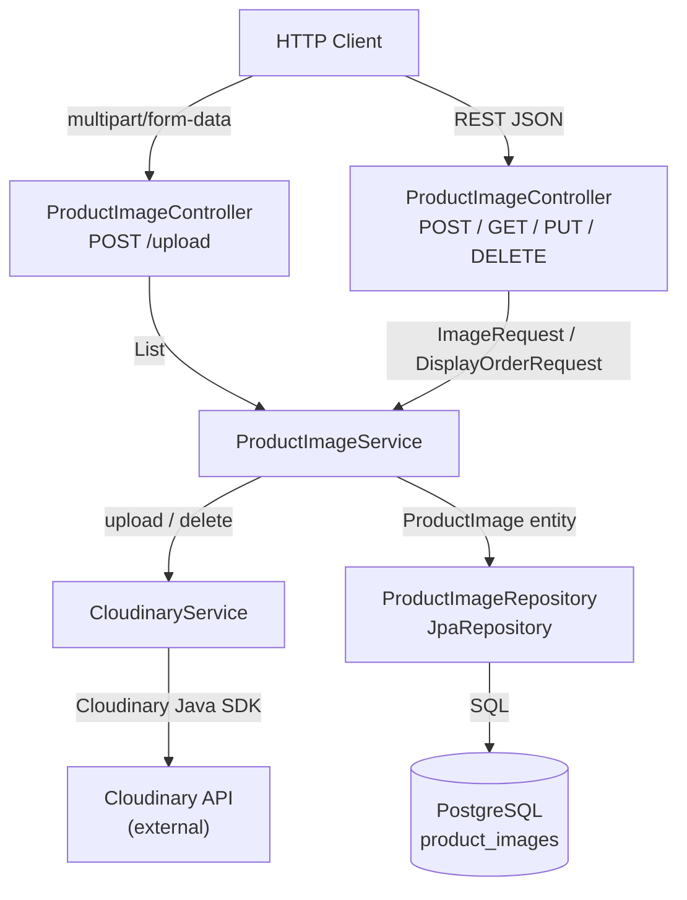
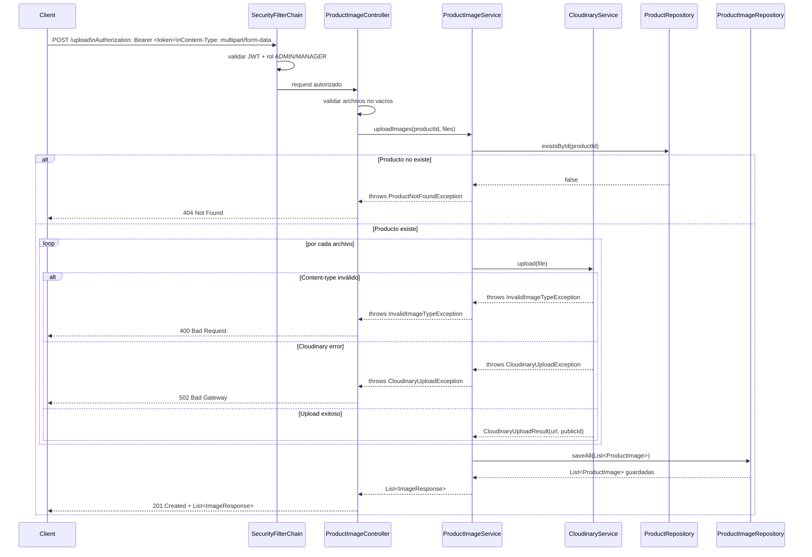
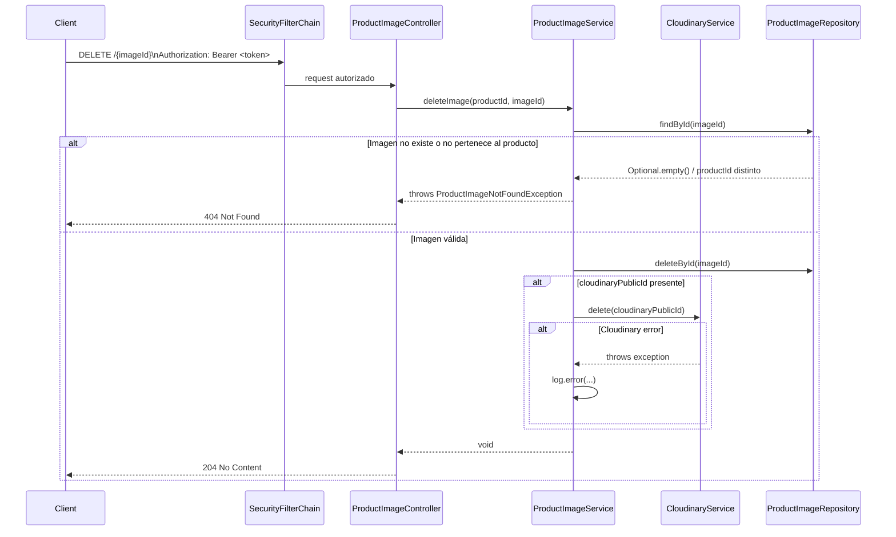

# Design Document: Product Images

## Overview

Este feature extiende el servicio `products` para soportar la subida directa de archivos de imagen a Cloudinary desde el cliente. Se añade un nuevo endpoint `POST /admin/api/products/{productId}/images/upload` que acepta `multipart/form-data`, delega la subida al nuevo `CloudinaryService`, y persiste la URL pública resultante junto con el `cloudinaryPublicId` en la entidad `ProductImage`.

El endpoint JSON existente `POST /admin/api/products/{productId}/images` (que acepta una lista de URLs) se mantiene sin cambios para compatibilidad hacia atrás.

La eliminación de imágenes (`DELETE /admin/api/products/{productId}/images/{imageId}`) se extiende para invocar la API de Cloudinary y eliminar el asset remoto antes de borrar el registro de BD. Si Cloudinary falla durante la eliminación, el error se registra en log pero la eliminación de BD se completa igualmente (HTTP 204).

Las credenciales de Cloudinary (`cloud-name`, `api-key`, `api-secret`) se externalizan en `application.yaml` y se inyectan vía `@ConfigurationProperties`.

---

## Architecture



---

## Sequence Diagrams

### POST /admin/api/products/{productId}/images/upload



### DELETE /admin/api/products/{productId}/images/{imageId} (con Cloudinary)



---

## Components and Interfaces

### ProductImageController (modificado)

Se añade el nuevo endpoint `POST /upload` con `consumes = MediaType.MULTIPART_FORM_DATA_VALUE`.

```java
// Nuevo endpoint
@PostMapping(value = "/upload", consumes = MediaType.MULTIPART_FORM_DATA_VALUE)
@PreAuthorize("hasAnyRole('ADMIN', 'MANAGER')")
ResponseEntity<List<ImageResponse>> uploadImages(
    @PathVariable Long productId,
    @RequestParam("files") List<MultipartFile> files);
```

El resto de métodos existentes no cambian.

### CloudinaryService (nuevo)

**Ubicación**: `com.example.products.service.CloudinaryService`

**Responsabilidades**:
- Inicializar el cliente Cloudinary con las credenciales de `CloudinaryProperties`.
- Validar que el `contentType` del archivo sea uno de los permitidos (`image/jpeg`, `image/png`, `image/webp`, `image/gif`).
- Subir el archivo a Cloudinary y devolver la URL pública y el `publicId`.
- Eliminar un asset de Cloudinary por `publicId`.

```java
public interface CloudinaryService {
    CloudinaryUploadResult upload(MultipartFile file);
    void delete(String publicId);
}
```

```java
// DTO interno (no expuesto en API)
public record CloudinaryUploadResult(String url, String publicId) {}
```

### CloudinaryServiceImpl (nuevo)

**Ubicación**: `com.example.products.service.CloudinaryServiceImpl`

```java
@Service
public class CloudinaryServiceImpl implements CloudinaryService {

    private static final Set<String> ALLOWED_TYPES =
        Set.of("image/jpeg", "image/png", "image/webp", "image/gif");

    private final Cloudinary cloudinary;

    public CloudinaryServiceImpl(CloudinaryProperties props) {
        this.cloudinary = new Cloudinary(ObjectUtils.asMap(
            "cloud_name", props.getCloudName(),
            "api_key",    props.getApiKey(),
            "api_secret", props.getApiSecret()
        ));
    }

    @Override
    public CloudinaryUploadResult upload(MultipartFile file) {
        if (!ALLOWED_TYPES.contains(file.getContentType())) {
            throw new InvalidImageTypeException(file.getContentType());
        }
        try {
            Map result = cloudinary.uploader().upload(file.getBytes(), ObjectUtils.emptyMap());
            return new CloudinaryUploadResult(
                (String) result.get("secure_url"),
                (String) result.get("public_id")
            );
        } catch (IOException e) {
            throw new CloudinaryUploadException("Cloudinary upload failed", e);
        }
    }

    @Override
    public void delete(String publicId) {
        try {
            cloudinary.uploader().destroy(publicId, ObjectUtils.emptyMap());
        } catch (IOException e) {
            throw new CloudinaryDeleteException("Cloudinary delete failed for: " + publicId, e);
        }
    }
}
```

### CloudinaryProperties (nuevo)

**Ubicación**: `com.example.products.config.CloudinaryProperties`

```java
@ConfigurationProperties(prefix = "cloudinary")
@Validated
public class CloudinaryProperties {

    @NotBlank
    private String cloudName;

    @NotBlank
    private String apiKey;

    @NotBlank
    private String apiSecret;

    // getters / setters via Lombok @Data
}
```

### ProductImageService / ProductImageServiceImpl (modificado)

Se añade el método `uploadImages` a la interfaz y se actualiza `deleteImage` para invocar `CloudinaryService.delete`.

```java
public interface ProductImageService {
    List<ImageResponse> addImages(Long productId, ImageRequest request);       // existente
    List<ImageResponse> uploadImages(Long productId, List<MultipartFile> files); // nuevo
    List<ImageResponse> getImages(Long productId);
    ImageResponse updateDisplayOrder(Long productId, Long imageId, DisplayOrderRequest request);
    void deleteImage(Long productId, Long imageId);
}
```

Lógica de `uploadImages`:
1. Verificar que el producto existe (`ProductNotFoundException` si no).
2. Obtener el conteo actual de imágenes para calcular `displayOrder` inicial.
3. Para cada archivo: llamar a `cloudinaryService.upload(file)` → obtener `url` y `publicId`.
4. Construir `ProductImage` con `url`, `cloudinaryPublicId` y `displayOrder` auto-asignado.
5. Persistir con `imageRepository.saveAll(...)`.
6. Devolver `List<ImageResponse>`.

Lógica de `deleteImage` (actualizada):
1. Verificar producto y pertenencia de imagen (igual que antes).
2. Guardar `cloudinaryPublicId` antes de borrar.
3. Llamar `imageRepository.deleteById(imageId)`.
4. Si `cloudinaryPublicId != null`: llamar `cloudinaryService.delete(publicId)` dentro de try/catch; en caso de excepción, solo loguear.

### GlobalExceptionHandler (modificado)

Se añaden handlers para las nuevas excepciones:

```java
@ExceptionHandler(InvalidImageTypeException.class)
ResponseEntity<ErrorResponse> handleInvalidImageType(InvalidImageTypeException ex)
// → 400 Bad Request

@ExceptionHandler(CloudinaryUploadException.class)
ResponseEntity<ErrorResponse> handleCloudinaryUpload(CloudinaryUploadException ex)
// → 502 Bad Gateway, message: "Cloudinary upload failed"
```

---

## Data Models

### ProductImage (entidad JPA — modificada)

Se añade el campo `cloudinaryPublicId` nullable para compatibilidad con registros anteriores.

```java
@Entity
@Table(name = "product_images")
@Data
@Builder
@NoArgsConstructor
@AllArgsConstructor
public class ProductImage {

    @Id
    @GeneratedValue(strategy = GenerationType.IDENTITY)
    private Long id;

    @Column(name = "product_id", nullable = false)
    private Long productId;

    @ManyToOne(fetch = FetchType.LAZY)
    @JoinColumn(name = "product_id", insertable = false, updatable = false)
    private Product product;

    @Column(nullable = false)
    private String url;

    @Column(name = "display_order", nullable = false)
    private Integer displayOrder;

    @Column(name = "cloudinary_public_id")  // nullable — backward compat
    private String cloudinaryPublicId;
}
```

### ImageResponse (DTO de salida — sin cambios)

`cloudinaryPublicId` NO se expone en este DTO.

```java
@Data @Builder @NoArgsConstructor @AllArgsConstructor
public class ImageResponse {
    private Long id;
    private Long productId;
    private String url;
    private Integer displayOrder;
}
```

### Nuevas excepciones

```java
// 400 — tipo de archivo no permitido
public class InvalidImageTypeException extends RuntimeException {
    public InvalidImageTypeException(String contentType) {
        super("Unsupported image type: " + contentType);
    }
}

// 502 — fallo en subida a Cloudinary
public class CloudinaryUploadException extends RuntimeException {
    public CloudinaryUploadException(String message, Throwable cause) {
        super(message, cause);
    }
}

// runtime — fallo en eliminación de Cloudinary (solo se loguea)
public class CloudinaryDeleteException extends RuntimeException {
    public CloudinaryDeleteException(String message, Throwable cause) {
        super(message, cause);
    }
}
```

### Liquibase changelog: 009-add-cloudinary-public-id-to-product-images.yaml

```yaml
databaseChangeLog:
  - changeSet:
      id: 009-add-cloudinary-public-id-to-product-images
      author: kiro
      changes:
        - addColumn:
            tableName: product_images
            columns:
              - column:
                  name: cloudinary_public_id
                  type: TEXT
                  constraints:
                    nullable: true
```

Se incluye en `db.changelog-master.yaml` como entrada adicional al final.

### Configuración: application.yaml (adición)

```yaml
cloudinary:
  cloud-name: ${CLOUDINARY_CLOUD_NAME}
  api-key: ${CLOUDINARY_API_KEY}
  api-secret: ${CLOUDINARY_API_SECRET}
```

Para el perfil `h2` (`application-h2.yaml`), se permiten valores placeholder:

```yaml
cloudinary:
  cloud-name: placeholder
  api-key: placeholder
  api-secret: placeholder
```

### Dependencia Maven: Cloudinary Java SDK

```xml
<dependency>
    <groupId>com.cloudinary</groupId>
    <artifactId>cloudinary-http5</artifactId>
    <version>2.2.0</version>
</dependency>
```

---

## Correctness Properties

*A property is a characteristic or behavior that should hold true across all valid executions of a system — essentially, a formal statement about what the system should do. Properties serve as the bridge between human-readable specifications and machine-verifiable correctness guarantees.*

### Property 1: Respuesta de upload contiene todos los campos requeridos

*Para cualquier* producto existente y cualquier lista de archivos válidos (tipo permitido, no vacíos), el endpoint `POST /upload` debe devolver HTTP 201 con una lista de `ImageResponse` donde cada elemento contiene `id` no nulo, `productId` igual al de la ruta, `url` con esquema `https://`, y `displayOrder` no negativo.

**Validates: Requirements 1.2, 1.4**

### Property 2: displayOrder auto-asignado es consecutivo desde el conteo actual

*Para cualquier* producto con N imágenes existentes, al subir M archivos válidos vía `POST /upload`, los nuevos `ImageResponse` deben tener `displayOrder` igual a N, N+1, ..., N+M-1 en el orden en que fueron enviados.

**Validates: Requirements 1.3**

### Property 3: Tipo de archivo inválido devuelve 400

*Para cualquier* archivo cuyo `Content-Type` no sea `image/jpeg`, `image/png`, `image/webp` ni `image/gif`, el endpoint `POST /upload` debe devolver HTTP 400 con un `ErrorResponse` sin persistir ninguna imagen.

**Validates: Requirements 1.7**

### Property 4: cloudinaryPublicId se persiste en cada imagen subida

*Para cualquier* upload exitoso, el registro `ProductImage` persistido en base de datos debe tener un `cloudinaryPublicId` no nulo que coincida con el `public_id` devuelto por Cloudinary.

**Validates: Requirements 4.2**

### Property 5: Eliminación invoca Cloudinary con el publicId correcto

*Para cualquier* imagen que tenga `cloudinaryPublicId` no nulo, al ejecutar `DELETE /admin/api/products/{productId}/images/{imageId}`, el `CloudinaryService` debe ser invocado con exactamente ese `publicId` y el registro debe ser eliminado de BD (HTTP 204).

**Validates: Requirements 2.1, 2.2**

### Property 6: cloudinaryPublicId no se expone en ImageResponse

*Para cualquier* `ImageResponse` devuelto por cualquier endpoint, la representación JSON no debe contener el campo `cloudinaryPublicId`.

**Validates: Requirements 4.3**

### Property 7: Producto inexistente devuelve 404 en todos los endpoints de imágenes

*Para cualquier* `productId` que no exista en la base de datos, todos los endpoints de imágenes (`POST`, `POST /upload`, `GET`, `PUT`, `DELETE`) deben devolver HTTP 404 con un `ErrorResponse`.

**Validates: Requirements 1.5**

### Property 8: Imagen que no pertenece al producto devuelve 404

*Para cualquier* `imageId` que exista en BD pero pertenezca a un `productId` distinto al indicado en la ruta, las operaciones `PUT` y `DELETE` deben devolver HTTP 404.

**Validates: Requirements 2.4**

### Property 9: Round-trip de creación de imágenes (endpoint JSON existente)

*Para cualquier* producto existente y cualquier lista válida de URLs, hacer `POST /admin/api/products/{id}/images` y luego `GET /admin/api/products/{id}/images` debe devolver una lista que contenga exactamente las URLs enviadas en el POST.

**Validates: Requirements 1.1 (endpoint existente)**

### Property 10: Imágenes ordenadas por displayOrder ascendente

*Para cualquier* producto con una o más imágenes, `GET /admin/api/products/{id}/images` debe devolver la lista ordenada de forma no decreciente por `displayOrder`.

**Validates: Requirements 1.3**

---

## Error Handling

| Situación | Excepción | Respuesta HTTP | Mensaje |
|---|---|---|---|
| `productId` no existe | `ProductNotFoundException` | `404 Not Found` | `"Product not found: {id}"` |
| `imageId` no existe o no pertenece al producto | `ProductImageNotFoundException` | `404 Not Found` | `"Image not found: {imageId}"` |
| Tipo de archivo no permitido | `InvalidImageTypeException` | `400 Bad Request` | `"Unsupported image type: {type}"` |
| Sin archivos o archivos vacíos | `MethodArgumentNotValidException` | `400 Bad Request` | Mensajes de Bean Validation |
| Error de Cloudinary durante upload | `CloudinaryUploadException` | `502 Bad Gateway` | `"Cloudinary upload failed"` |
| Error de Cloudinary durante delete | `CloudinaryDeleteException` | — (solo log) | N/A — la operación continúa |
| URL inválida en `ImageRequest` (endpoint JSON) | `MethodArgumentNotValidException` | `400 Bad Request` | Mensajes de Bean Validation |
| Petición de escritura sin JWT | Spring Security | `401 Unauthorized` | `WWW-Authenticate: Bearer` |
| Rol insuficiente | Spring Security | `403 Forbidden` | — |
| Error inesperado | `Exception` | `500 Internal Server Error` | `"An unexpected error occurred"` |

---

## Testing Strategy

### Enfoque dual: unit tests + property-based tests

**Unit tests** (JUnit 5 + Mockito — `@ExtendWith(MockitoExtension.class)`):

- `CloudinaryServiceImplTest`:
  - Upload exitoso → devuelve `CloudinaryUploadResult` con url y publicId correctos.
  - Upload con content-type inválido → lanza `InvalidImageTypeException`.
  - Upload con error de SDK → lanza `CloudinaryUploadException`.
  - Delete exitoso → no lanza excepción.
  - Delete con error de SDK → lanza `CloudinaryDeleteException`.

- `ProductImageServiceImplTest` (extendido):
  - `uploadImages` happy path → persiste `cloudinaryPublicId` y devuelve `ImageResponse` correctos.
  - `uploadImages` con producto inexistente → lanza `ProductNotFoundException`.
  - `deleteImage` con `cloudinaryPublicId` presente → invoca `CloudinaryService.delete`.
  - `deleteImage` con `cloudinaryPublicId` nulo → no invoca `CloudinaryService.delete`.
  - `deleteImage` cuando Cloudinary falla → completa la eliminación de BD igualmente.

- `ProductImageControllerTest` (`@WebMvcTest`, extendido):
  - `POST /upload` sin JWT → 401.
  - `POST /upload` con rol insuficiente → 403.
  - `POST /upload` con content-type inválido → 400.
  - `POST /upload` sin archivos → 400.
  - `POST /upload` con error de Cloudinary (mock) → 502.
  - `POST /upload` exitoso → 201 con lista de `ImageResponse`.

**Property-based tests** (jqwik — ya incluido en `pom.xml`):

> Cada property test debe ejecutarse con mínimo **100 iteraciones**.
> Cada test debe incluir un comentario con el tag:
> `// Feature: product-images, Property <N>: <texto de la propiedad>`

| Property | Descripción del test |
|---|---|
| P1 | Generar productos y listas de archivos válidos aleatorios (mocked CloudinaryService); verificar que cada `ImageResponse` tiene `id`, `productId`, `url` HTTPS y `displayOrder >= 0` |
| P2 | Generar productos con N imágenes existentes y M archivos nuevos; verificar que los nuevos `displayOrder` son N, N+1, ..., N+M-1 |
| P3 | Generar content-types aleatorios fuera del conjunto permitido; verificar 400 sin persistencia |
| P4 | Generar uploads exitosos con `publicId` aleatorio (mocked); verificar que el `ProductImage` en BD tiene ese `cloudinaryPublicId` |
| P5 | Generar imágenes con `cloudinaryPublicId` aleatorio; DELETE y verificar que `CloudinaryService.delete` fue llamado con ese `publicId` y BD no contiene el registro |
| P6 | Generar cualquier `ImageResponse` (via GET o POST); verificar que el JSON serializado no contiene la clave `cloudinaryPublicId` |
| P7 | Generar `productId` aleatorios no existentes; verificar 404 en POST/upload, GET, PUT, DELETE |
| P8 | Generar imágenes de producto A e intentar PUT/DELETE vía producto B; verificar 404 |
| P9 | Generar productos y listas de URLs válidas; POST JSON + GET y verificar que las URLs devueltas coinciden |
| P10 | Generar productos con imágenes de `displayOrder` aleatorio; GET y verificar orden ascendente |

Los property tests de integración extienden `AbstractIntegrationTest` (Testcontainers PostgreSQL). Los tests de seguridad y validación usan `@WebMvcTest` con `JwtDecoder` mockeado.
