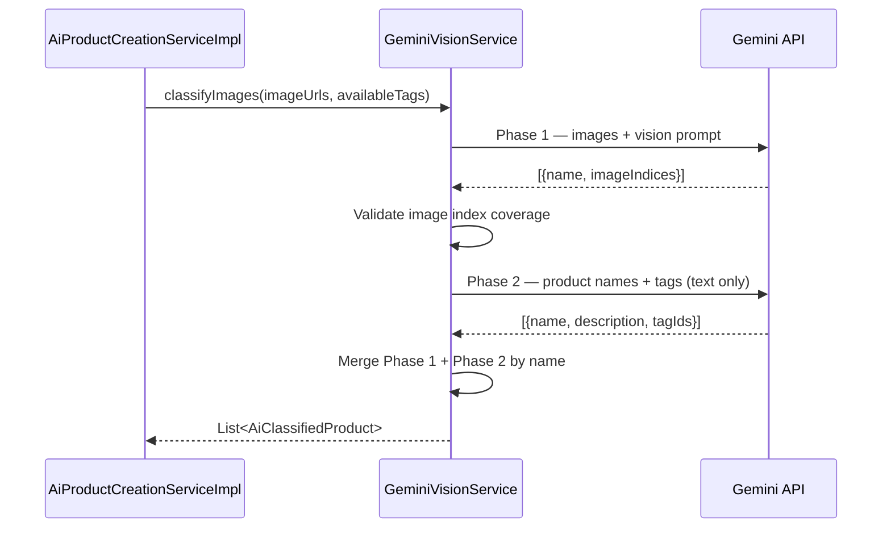

# Design Document: Split Gemini Classification

## Overview

This design refactors `GeminiVisionService.classifyImages()` from a single Gemini API call into two sequential calls:

1. **Phase 1 (Vision call):** Sends images to Gemini and receives product names + image grouping. No tag or description logic.
2. **Phase 2 (Text-only call):** Sends the product names from Phase 1 along with available tags, and receives descriptions + tag ID assignments. No image data.

The public interface (`AiVisionService.classifyImages`) remains unchanged — the orchestrator (`AiProductCreationServiceImpl`) is unaffected.

### Rationale

- Reduces per-call complexity and token usage for the vision model.
- Separates concerns: visual analysis vs. text generation/classification.
- Phase 2 is cheaper (no image tokens) and can be retried independently.

## Architecture



The refactoring is entirely internal to `GeminiVisionService`. No changes to the interface, orchestrator, or downstream consumers.

## Components and Interfaces

### Public Interface (unchanged)

```java
public interface AiVisionService {
    List<AiClassifiedProduct> classifyImages(List<String> imageUrls, List<TagResponse> availableTags);
}
```

### Internal Methods (new in GeminiVisionService)

| Method | Responsibility |
|--------|---------------|
| `classifyImages(...)` | Orchestrates Phase 1 → validate → Phase 2 → merge |
| `executePhase1(List<String> imageUrls)` | Builds vision request, calls Gemini, parses Phase 1 response |
| `executePhase2(List<String> productNames, List<TagResponse> tags)` | Builds text request, calls Gemini, parses Phase 2 response |
| `validatePhase1Coverage(List<Phase1Result> results, int imageCount)` | Ensures every index 0..N-1 appears exactly once |
| `mergeResults(List<Phase1Result> phase1, List<Phase2Result> phase2)` | Joins by product name into `AiClassifiedProduct` |
| `buildPhase1Prompt(int imageCount)` | Returns the Phase 1 prompt string |
| `buildPhase2Prompt(List<String> productNames, String tagListJson)` | Returns the Phase 2 prompt string |

### Prompt Design

**Phase 1 prompt** — instructs Gemini to:
- Group images by product
- Return product names in Spanish
- Return image indices per product
- NOT generate descriptions or assign tags

**Phase 2 prompt** — instructs Gemini to:
- Generate a brief, factual Spanish description for each product name
- Assign tag IDs from the provided tag list
- NOT reference images

## Data Models

### Phase1Result (new intermediate model)

```java
@Data
@Builder
@NoArgsConstructor
@AllArgsConstructor
public class Phase1Result {
    private String name;
    private List<Integer> imageIndices;
}
```

Used as the deserialization target for the Phase 1 Gemini response. Contains only visual analysis output.

### Phase2Result (new intermediate model)

```java
@Data
@Builder
@NoArgsConstructor
@AllArgsConstructor
public class Phase2Result {
    private String name;
    private String description;
    private List<Long> tagIds;
}
```

Used as the deserialization target for the Phase 2 Gemini response. Contains text-generation output.

### AiClassifiedProduct (unchanged)

```java
@Data
@Builder
@NoArgsConstructor
@AllArgsConstructor
public class AiClassifiedProduct {
    private String name;
    private String description;
    private List<Integer> imageIndices;
    private List<Long> tagIds;
}
```

Final merged output returned to the orchestrator. No changes needed.

### Response Schemas (Gemini structured output)

**Phase 1 schema:**
```json
{
  "type": "ARRAY",
  "items": {
    "type": "OBJECT",
    "properties": {
      "name": { "type": "STRING" },
      "imageIndices": { "type": "ARRAY", "items": { "type": "INTEGER" } }
    },
    "required": ["name", "imageIndices"]
  }
}
```

**Phase 2 schema:**
```json
{
  "type": "ARRAY",
  "items": {
    "type": "OBJECT",
    "properties": {
      "name": { "type": "STRING" },
      "description": { "type": "STRING" },
      "tagIds": { "type": "ARRAY", "items": { "type": "INTEGER" } }
    },
    "required": ["name", "description", "tagIds"]
  }
}
```


## Correctness Properties

*A property is a characteristic or behavior that should hold true across all valid executions of a system — essentially, a formal statement about what the system should do. Properties serve as the bridge between human-readable specifications and machine-verifiable correctness guarantees.*

### Property 1: Intermediate model serialization round-trip

*For any* valid `Phase1Result` list or `Phase2Result` list, serializing to JSON with Gson and deserializing back SHALL produce an object equal to the original.

**Validates: Requirements 1.3, 2.3**

### Property 2: Image index coverage validation accepts valid partitions

*For any* integer N > 0 and any partition of the set {0, 1, ..., N-1} into non-empty disjoint subsets, the validation function SHALL accept the partition. Conversely, for any collection of index lists that does NOT form a complete partition of {0..N-1} (missing indices, duplicates, or out-of-range values), the validation function SHALL reject it.

**Validates: Requirements 1.5**

### Property 3: Merge produces correct combined output

*For any* list of `Phase1Result` items and a corresponding list of `Phase2Result` items with matching product names, the merge function SHALL produce a list of `AiClassifiedProduct` where each entry has `name` and `imageIndices` from Phase 1 and `description` and `tagIds` from Phase 2.

**Validates: Requirements 2.5, 3.1**

### Property 4: Phase 2 prompt includes all available tags

*For any* non-empty list of `TagResponse` objects, the Phase 2 prompt builder SHALL produce a string that contains every tag's ID and name from the input list.

**Validates: Requirements 5.4**

## Error Handling

| Scenario | Behavior |
|----------|----------|
| Phase 1 Gemini call fails (network, API error, malformed response) | Exception propagates immediately. Phase 2 is never attempted. |
| Phase 1 response fails index coverage validation | `IllegalStateException` thrown with details about missing/duplicate indices. Phase 2 not attempted. |
| Phase 2 Gemini call fails | Phase 1 results are logged at WARN level for debugging. Exception propagates to caller. |
| Phase 2 returns a product name not present in Phase 1 | That entry is ignored during merge (logged as warning). |
| Phase 1 returns a product name with no matching Phase 2 entry | `IllegalStateException` thrown — every Phase 1 product must have a Phase 2 match. |

### Exception Types

- **RuntimeException** (from Gemini SDK): network/API failures — propagated as-is.
- **IllegalStateException**: validation failures (index coverage, missing Phase 2 matches) — indicates an unexpected AI response that violates the schema contract.

## Testing Strategy

### Unit Tests (Mockito)

| Test | What it verifies |
|------|-----------------|
| `buildPhase1Prompt` does not mention tags or descriptions | Req 1.2 |
| `buildPhase1Prompt` mentions Spanish for names | Req 5.3 |
| `buildPhase2Prompt` mentions Spanish, brief, factual | Req 5.5 |
| Phase 1 schema has correct required fields | Req 1.4 |
| Phase 2 schema has correct required fields | Req 2.4 |
| Phase 1 failure prevents Phase 2 execution | Req 4.1 |
| Phase 2 failure logs Phase 1 results | Req 4.2 |
| Phase 2 failure propagates to caller | Req 4.3 |
| `executePhase2` builds Content with no image parts | Req 2.2 |

### Property-Based Tests (jqwik)

The project already includes `net.jqwik:jqwik:1.9.3`. Each property test runs a minimum of 100 iterations.

| Property | Tag |
|----------|-----|
| Serialization round-trip for Phase1Result and Phase2Result | `Feature: split-gemini-classification, Property 1: Intermediate model serialization round-trip` |
| Index coverage validation (valid + invalid partitions) | `Feature: split-gemini-classification, Property 2: Image index coverage validation accepts valid partitions` |
| Merge correctness | `Feature: split-gemini-classification, Property 3: Merge produces correct combined output` |
| Phase 2 prompt tag inclusion | `Feature: split-gemini-classification, Property 4: Phase 2 prompt includes all available tags` |

### Integration Tests

| Test | What it verifies |
|------|-----------------|
| Full `classifyImages` with mocked Gemini client | End-to-end flow: Phase 1 → validate → Phase 2 → merge → correct output (Req 3.2) |
| Phase 1 request contains image parts + vision prompt | Req 1.1 |
| Phase 2 request contains only text parts | Req 2.1 |

### Test Generators (jqwik Arbitraries)

- **Phase1Result generator**: random Spanish-like product names (alphabetic strings), random non-empty subsets of indices forming a valid partition.
- **Phase2Result generator**: matching names from Phase 1, random Spanish description strings, random subsets of tag IDs from a generated tag list.
- **TagResponse generator**: random IDs (positive longs), random name strings, random type strings.
- **Invalid partition generator**: partitions with gaps, duplicates, or out-of-range indices for Property 2 negative cases.
