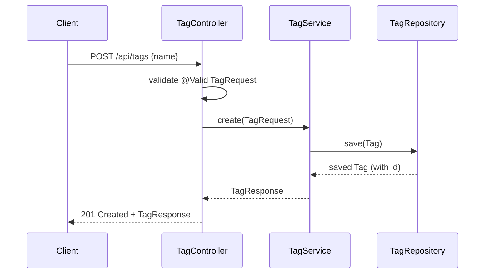
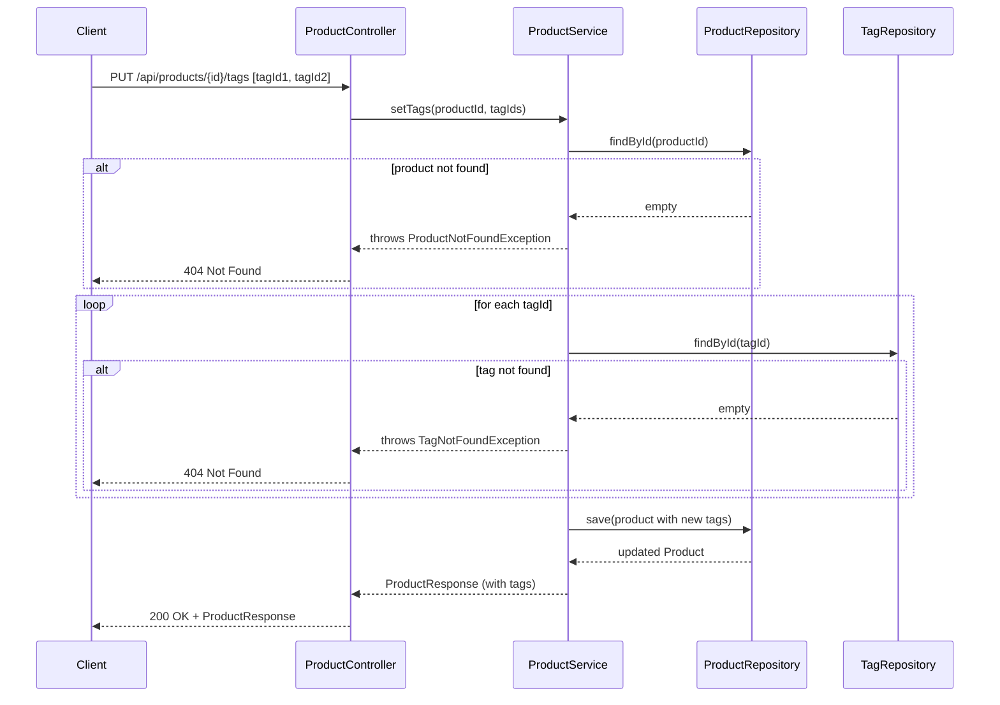

# Design Document: Tags

## Overview

This feature introduces a `Tag` entity and a many-to-many relationship between `Tag` and `Product`. It exposes a full CRUD API under `/api/tags` and an association endpoint `PUT /api/products/{id}/tags` that replaces the tag set of a product. The `ProductResponse` is extended to include the list of associated tags.

The implementation follows the same layered architecture used throughout the application: REST controller → service → repository → JPA entity, with Liquibase managing the schema.

## Architecture

```mermaid
graph TD
    Client["HTTP Client"]
    TC["TagController\n/api/tags"]
    PC["ProductController\n/api/products"]
    TS["TagService"]
    PS["ProductService"]
    TR["TagRepository"]
    PR["ProductRepository"]
    DB[("PostgreSQL")]

    Client -->|CRUD| TC
    Client -->|PUT /{id}/tags| PC
    TC --> TS
    PC --> PS
    TS --> TR
    PS --> PR
    PS --> TR
    TR --> DB
    PR --> DB
```

## Database Schema

```
tags
├── id        BIGSERIAL  PK
└── name      VARCHAR(100)  NOT NULL  UNIQUE

product_tag
├── product_id  BIGINT  FK → products(id)  NOT NULL
└── tag_id      BIGINT  FK → tags(id)      NOT NULL
PK (product_id, tag_id)
```

## Sequence Diagrams

### Create Tag (POST /api/tags)



### Associate Tags with Product (PUT /api/products/{id}/tags)



## Components and Interfaces

### TagController

```java
@RestController
@RequestMapping("/api/tags")
public class TagController {
    TagResponse create(@Valid @RequestBody TagRequest request);        // POST /
    List<TagResponse> findAll();                                       // GET /
    TagResponse findById(@PathVariable Long id);                      // GET /{id}
    TagResponse update(@PathVariable Long id,
                       @Valid @RequestBody TagRequest request);        // PUT /{id}
    void delete(@PathVariable Long id);                               // DELETE /{id}
}
```

Write operations (`POST`, `PUT`, `DELETE`) are protected with `@PreAuthorize("hasAnyRole('ADMIN', 'MANAGER')")`.

### TagService

```java
public interface TagService {
    TagResponse create(TagRequest request);
    List<TagResponse> findAll();
    TagResponse findById(Long id);
    TagResponse update(Long id, TagRequest request);
    void delete(Long id);
}
```

### TagRepository

```java
public interface TagRepository extends JpaRepository<Tag, Long> {
    Optional<Tag> findByNameIgnoreCase(String name);
    boolean existsByNameIgnoreCase(String name);
}
```

### ProductService (extended)

```java
public interface ProductService {
    // ... existing methods ...
    ProductResponse setTags(Long productId, Set<Long> tagIds);
}
```

`setTags` is `@Transactional` — it loads the product, resolves each tag id (throwing `TagNotFoundException` on any miss), replaces the tag set, and saves.

## Data Models

### Tag (JPA Entity)

```java
@Entity
@Table(name = "tags")
public class Tag {
    @Id @GeneratedValue(strategy = GenerationType.IDENTITY)
    private Long id;

    @Column(nullable = false, unique = true, length = 100)
    private String name;

    @ManyToMany(mappedBy = "tags")
    @ToString.Exclude @EqualsAndHashCode.Exclude
    private Set<Product> products = new HashSet<>();
}
```

### Product (extended)

```java
@ManyToMany
@JoinTable(
    name = "product_tag",
    joinColumns = @JoinColumn(name = "product_id"),
    inverseJoinColumns = @JoinColumn(name = "tag_id")
)
private Set<Tag> tags = new HashSet<>();
```

`Product` owns the relationship. `Tag.products` is the inverse side (`mappedBy = "tags"`).

### TagRequest (DTO — inbound)

```java
public class TagRequest {
    @NotBlank
    @Size(max = 100)
    private String name;
}
```

### TagResponse (DTO — outbound)

```java
public class TagResponse {
    private Long id;
    private String name;
}
```

### ProductResponse (extended)

```java
public class ProductResponse {
    // ... existing fields ...
    private List<TagResponse> tags = new ArrayList<>();
}
```

## Key Algorithms

### setTags Algorithm

```pascal
ALGORITHM setTags(productId: Long, tagIds: Set<Long>): ProductResponse
PRECONDITION: productId != null

BEGIN
  product ← productRepository.findById(productId)
  IF product IS EMPTY THEN
    THROW ProductNotFoundException(productId)
  END IF

  resolvedTags ← empty Set
  FOR EACH tagId IN tagIds DO
    tag ← tagRepository.findById(tagId)
    IF tag IS EMPTY THEN
      THROW TagNotFoundException(tagId)
    END IF
    resolvedTags.add(tag)
  END FOR

  product.setTags(resolvedTags)
  saved ← productRepository.save(product)
  RETURN toResponse(saved)
END

POSTCONDITION: product.tags == resolvedTags OR exception thrown
```

The operation is a full replacement — calling `setTags` with an empty set removes all tags from the product.

## Correctness Properties

### Property 1: Tag create-then-retrieve round-trip

For any valid `TagRequest`, creating a tag via `POST /api/tags` and retrieving it via `GET /api/tags/{id}` should return a `TagResponse` with the same `name`.

**Validates: Requirements 1.1, 3.1**

### Property 2: Tag update-then-retrieve round-trip

For any existing tag and valid `TagRequest`, updating via `PUT /api/tags/{id}` and retrieving via `GET /api/tags/{id}` should return the updated `name`.

**Validates: Requirement 4.1**

### Property 3: Tag delete-then-retrieve returns 404

For any existing tag, deleting via `DELETE /api/tags/{id}` and then calling `GET /api/tags/{id}` should return `404 Not Found`.

**Validates: Requirements 5.1, 3.2**

### Property 4: setTags replaces tag set completely

For any product and any set of valid tag ids S, calling `PUT /api/products/{id}/tags` with S and then `GET /api/products/{id}` should return a product whose `tags` list contains exactly the tags in S.

**Validates: Requirements 6.1, 6.2, 7.1**

### Property 5: setTags with unknown tag id returns 404

For any product and a set of tag ids containing at least one non-existent id, `PUT /api/products/{id}/tags` should return `404 Not Found` and the product's tags should remain unchanged.

**Validates: Requirement 6.4**

## Error Handling

| Exception | HTTP Status | Condition |
|---|---|---|
| `TagNotFoundException` | 404 Not Found | Tag id does not exist |
| `ProductNotFoundException` | 404 Not Found | Product id does not exist in `setTags` |
| `MethodArgumentNotValidException` | 400 Bad Request | Blank or oversized `name` in `TagRequest` |
| `Exception` (generic) | 500 Internal Server Error | Unexpected runtime error |

## Security

Write operations on `/api/tags` and `PUT /api/products/{id}/tags` require `ADMIN` or `MANAGER` role, consistent with the rest of the application. Read operations (`GET`) are public.
