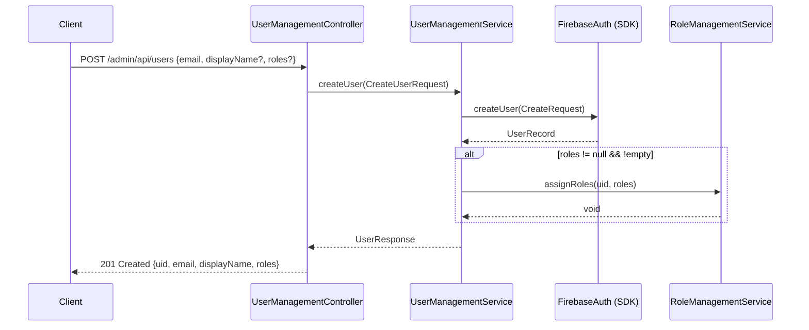

# Design Document: User Management

## Overview

Este módulo agrega la capacidad de crear usuarios en Firebase Authentication directamente desde la API del backend. Expone `POST /admin/api/users` protegido con `ROLE_ADMIN`, acepta los datos del nuevo usuario (email, displayName opcional, roles opcionales), delega la creación al Firebase Admin SDK y retorna el usuario creado con sus roles.

El diseño sigue la arquitectura en capas existente (`controller → service`) sin introducir ninguna capa de persistencia, ya que Firebase Authentication es la única fuente de verdad para los usuarios.

**Decisiones de diseño clave:**
- Se reutiliza el bean `FirebaseAuth` de `FirebaseConfig` — no se instancia nada nuevo.
- Se reutiliza `RoleManagementService.assignRoles()` para la asignación de roles post-creación.
- `FirebaseUserAlreadyExistsException` es una nueva excepción registrada en `GlobalExceptionHandler` siguiendo el patrón existente.
- La asignación de roles es best-effort dentro del mismo request: si falla, el usuario queda creado sin roles y se retorna HTTP 500.

---

## Architecture



**Flujo de errores:**

| Condición | Excepción | HTTP |
|---|---|---|
| Email ya existe en Firebase | `FirebaseUserAlreadyExistsException` | 409 |
| Error inesperado del SDK | `RuntimeException` (propagada) | 500 |
| Fallo en `assignRoles` post-creación | `RuntimeException` (propagada) | 500 |
| Datos de entrada inválidos | `MethodArgumentNotValidException` | 400 |
| Sin token / token inválido | Spring Security | 401 |
| Token sin `ROLE_ADMIN` | Spring Security | 403 |

---

## Components and Interfaces

### UserManagementController

```java
@RestController
@RequestMapping("/admin/api/users")
public class UserManagementController {

    @PostMapping
    @PreAuthorize("hasRole('ADMIN')")
    public ResponseEntity<UserResponse> createUser(@Valid @RequestBody CreateUserRequest request);
}
```

- Aplica `@Valid` para activar Bean Validation antes de invocar el servicio.
- Retorna `ResponseEntity.status(HttpStatus.CREATED).body(userResponse)`.
- No contiene lógica de negocio — delega completamente a `UserManagementService`.

### UserManagementService (interfaz)

```java
public interface UserManagementService {
    UserResponse createUser(CreateUserRequest request);
}
```

### UserManagementServiceImpl

- Inyecta `FirebaseAuth` y `RoleManagementService` por constructor.
- Construye un `UserRecord.CreateRequest` con email y displayName (si presente).
- Llama a `firebaseAuth.createUser(createRequest)`.
- Detecta `FirebaseAuthException` con error code `EMAIL_ALREADY_EXISTS` → lanza `FirebaseUserAlreadyExistsException`.
- Cualquier otro `FirebaseAuthException` → loguea y relanza como `RuntimeException`.
- Si `roles` es no-nulo y no-vacío → llama `roleManagementService.assignRoles(uid, roles)`.
- Construye y retorna `UserResponse`.

### FirebaseUserAlreadyExistsException

```java
public class FirebaseUserAlreadyExistsException extends RuntimeException {
    public FirebaseUserAlreadyExistsException(String email) {
        super("Email already in use: " + email);
    }
}
```

### GlobalExceptionHandler (adición)

Nuevo handler siguiendo el patrón existente:

```java
@ExceptionHandler(FirebaseUserAlreadyExistsException.class)
public ResponseEntity<ErrorResponse> handleFirebaseUserAlreadyExists(FirebaseUserAlreadyExistsException ex) {
    // retorna HTTP 409
}
```

---

## Data Models

### CreateUserRequest (DTO de entrada)

```java
public class CreateUserRequest {
    @NotBlank
    @Email
    @Size(max = 254)
    private String email;

    @Size(max = 256)
    private String displayName;   // opcional, nullable

    private List<String> roles;   // opcional, nullable
}
```

### UserResponse (DTO de salida)

```java
public class UserResponse {
    private String uid;
    private String email;
    private String displayName;          // nullable
    private List<String> roles;          // nunca null, vacía si no se asignaron roles
}
```

**Invariante:** `roles` nunca es `null` en `UserResponse` — se inicializa como `List.of()` cuando no se asignan roles.

---

## Correctness Properties

*A property is a characteristic or behavior that should hold true across all valid executions of a system — essentially, a formal statement about what the system should do. Properties serve as the bridge between human-readable specifications and machine-verifiable correctness guarantees.*

### Property 1: Creación válida retorna respuesta completa

*For any* `CreateUserRequest` con email válido (y displayName opcional), cuando Firebase crea el usuario exitosamente, la respuesta debe ser HTTP 201 y el `UserResponse` debe contener un `uid` no-nulo, el mismo `email` del request, el `displayName` del request (o null si no se proporcionó), y un campo `roles` no-nulo.

**Validates: Requirements 1.2, 1.4, 5.1, 5.3**

---

### Property 2: Email inválido es rechazado con 400

*For any* string que no sea un email válido según RFC 5321 o que supere 254 caracteres, el endpoint debe rechazar la solicitud con HTTP 400 y un `ErrorResponse` que identifique el campo `email`.

**Validates: Requirements 2.1, 2.3**

---

### Property 3: displayName excesivo es rechazado con 400

*For any* `displayName` que supere 256 caracteres, el endpoint debe rechazar la solicitud con HTTP 400 y un `ErrorResponse` que identifique el campo `displayName`.

**Validates: Requirements 2.2**

---

### Property 4: Roles del request se reflejan en la respuesta

*For any* `CreateUserRequest` con una lista `roles` no-nula y no-vacía, cuando el usuario es creado y los roles son asignados exitosamente, el `UserResponse.roles` debe ser igual a la lista de roles enviada en el request.

**Validates: Requirements 6.2, 6.5**

---

### Property 5: Ausencia de roles produce lista vacía en respuesta

*For any* `CreateUserRequest` donde `roles` es `null` o una lista vacía `[]`, el `UserResponse.roles` debe ser una lista vacía (no null), y `RoleManagementService.assignRoles` no debe ser invocado.

**Validates: Requirements 6.3, 6.4, 6.6**

---

### Property 6: Email duplicado produce HTTP 409

*For any* email que ya exista en Firebase Authentication, el endpoint debe retornar HTTP 409 con un `ErrorResponse` cuyo mensaje indique que el email ya está en uso.

**Validates: Requirements 3.1, 3.2**

---

## Error Handling

### Detección de email duplicado

El Firebase Admin SDK lanza `FirebaseAuthException` con `AuthErrorCode.EMAIL_ALREADY_EXISTS` cuando el email ya existe. `UserManagementServiceImpl` captura esta excepción específica y lanza `FirebaseUserAlreadyExistsException`, que el `GlobalExceptionHandler` mapea a HTTP 409.

```java
try {
    UserRecord record = firebaseAuth.createUser(createRequest);
    // ...
} catch (FirebaseAuthException e) {
    if (AuthErrorCode.EMAIL_ALREADY_EXISTS.equals(e.getAuthErrorCode())) {
        throw new FirebaseUserAlreadyExistsException(request.getEmail());
    }
    log.error("Firebase SDK error creating user: {}", e.getMessage(), e);
    throw new RuntimeException("Firebase error: " + e.getMessage(), e);
}
```

### Fallo en assignRoles post-creación

Si `assignRoles` lanza una excepción después de que el usuario fue creado, la excepción se propaga sin intentar rollback (Firebase Authentication no soporta transacciones). El usuario queda creado sin roles. El `GlobalExceptionHandler` genérico captura la excepción y retorna HTTP 500. Este comportamiento está documentado en el Requirement 6.7.

### Validación de entrada

`@Valid` en el controller activa Bean Validation. `MethodArgumentNotValidException` es capturada por el handler existente en `GlobalExceptionHandler` y retorna HTTP 400 con los campos inválidos.

---

## Testing Strategy

### Enfoque dual: unit tests + property-based tests

Se usan dos tipos de tests complementarios:
- **Unit tests** (JUnit 5 + Mockito): casos específicos, condiciones de error, interacciones con mocks.
- **Property-based tests** (jqwik): propiedades universales sobre rangos de inputs generados.

El proyecto ya usa jqwik (ver `RoleManagementPropertyTest.java`, `FirebaseAuthPropertyTest.java`).

### Unit Tests (`UserManagementControllerTest`)

Usando `@WebMvcTest` + `MockMvc` + Mockito:

- Creación exitosa sin roles → HTTP 201, `UserResponse` con `roles = []`
- Creación exitosa con roles → HTTP 201, `UserResponse` con roles asignados
- Email inválido → HTTP 400
- Email duplicado → HTTP 409 (mock `UserManagementService` lanza `FirebaseUserAlreadyExistsException`)
- Error inesperado del SDK → HTTP 500
- Sin token → HTTP 401
- Token sin `ROLE_ADMIN` → HTTP 403
- `displayName` null → `UserResponse.displayName` es null
- `assignRoles` falla post-creación → HTTP 500

### Unit Tests (`UserManagementServiceImplTest`)

Usando `@ExtendWith(MockitoExtension.class)` con mocks de `FirebaseAuth` y `RoleManagementService`:

- SDK crea usuario → `assignRoles` es invocado cuando roles no-vacíos
- SDK crea usuario → `assignRoles` NO es invocado cuando roles es null
- SDK crea usuario → `assignRoles` NO es invocado cuando roles es `[]`
- SDK lanza `EMAIL_ALREADY_EXISTS` → se lanza `FirebaseUserAlreadyExistsException`
- SDK lanza otro error → se lanza `RuntimeException`

### Property-Based Tests (`UserManagementPropertyTest`)

Usando jqwik con mínimo 100 iteraciones por propiedad:

```java
// Feature: user-management, Property 1: valid creation returns complete response
@Property(tries = 100)
void validCreationReturnsCompleteResponse(@ForAll @From("validCreateUserRequests") CreateUserRequest req) { ... }

// Feature: user-management, Property 2: invalid email rejected with 400
@Property(tries = 100)
void invalidEmailRejectedWith400(@ForAll @From("invalidEmails") String email) { ... }

// Feature: user-management, Property 3: displayName too long rejected with 400
@Property(tries = 100)
void displayNameTooLongRejectedWith400(@ForAll @StringLength(min = 257, max = 512) String displayName) { ... }

// Feature: user-management, Property 4: roles in request reflected in response
@Property(tries = 100)
void rolesReflectedInResponse(@ForAll @From("nonEmptyRoleLists") List<String> roles) { ... }

// Feature: user-management, Property 5: null or empty roles produces empty list in response
@Property(tries = 100)
void nullOrEmptyRolesProducesEmptyList(@ForAll boolean useNull) { ... }

// Feature: user-management, Property 6: duplicate email produces HTTP 409
@Property(tries = 100)
void duplicateEmailProduces409(@ForAll @Email String email) { ... }
```

Cada property-based test referencia la propiedad del diseño con el tag:
`Feature: user-management, Property N: <texto de la propiedad>`
